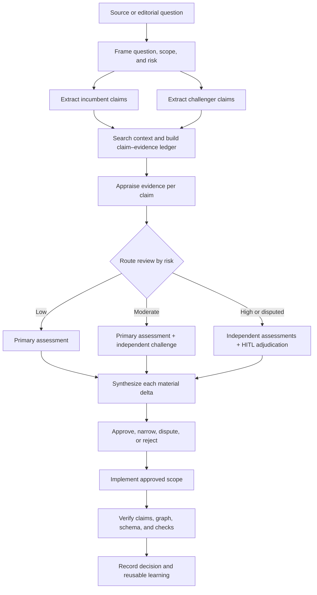
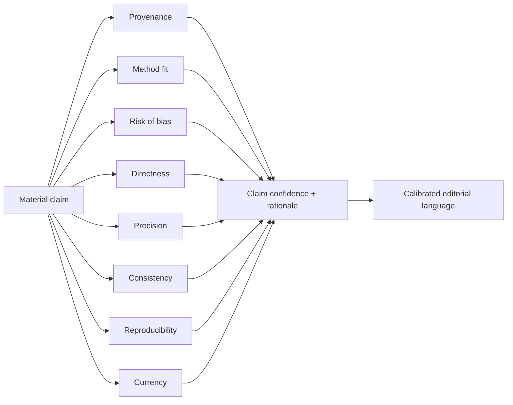
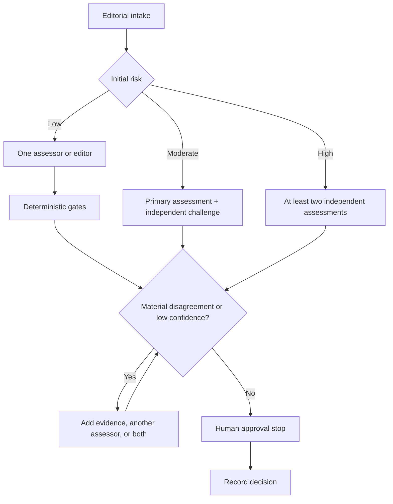
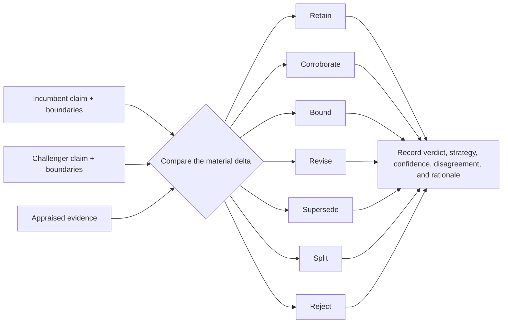

# Academic Editorial Pipeline

> **Purpose:** Turn source material into evidence-calibrated ASDLC knowledge without making routine editorial work unnecessarily expensive. The pipeline preserves provenance, distinguishes evidence from judgment, and escalates review in proportion to risk.

## 1. Decision Summary

The editorial pipeline uses four controls:

1. **Independent claim extraction:** The incumbent article and challenger source are reduced to separate claim sets before they are compared.
2. **Claim-specific evidence appraisal:** Evidence is judged against the claim it supports; no source type automatically outranks every other source type.
3. **Risk-proportional review:** Deterministic checks are always required. Additional independent assessors and human adjudication are added when the change is consequential or disputed.
4. **Traceable synthesis:** Every material change records the claim, evidence, confidence, editorial operation, and decision rationale.

The knowledge base remains the incumbent baseline because it carries prior editorial decisions and graph relationships. It is not presumed true. A challenger may corroborate, bound, revise, supersede, or split the baseline when the evidence and scope warrant it.



## 2. Scope

This pipeline applies when creating or substantively revising Concepts, Patterns, and Practices from external sources, internal telemetry, or new editorial arguments.

It is not required in full for:

- spelling, formatting, or metadata corrections that do not change meaning;
- mechanical schema migrations with separately reviewed transformation rules;
- content changes already specified by an approved, evidence-bearing assessment.

Those changes still run the deterministic repository gates required by `AGENTS.md` and the relevant content spec.

## 3. Operating Principles

### 3.1 Agreement is not correctness

Multiple assessors can expose different interpretations and failure modes, but their agreement does not establish truth. Models may share training data, architectural assumptions, benchmarks, and error patterns. Consensus is therefore a routing signal:

- agreement can reduce the need for further interpretation;
- disagreement identifies a decision that needs adjudication;
- neither agreement nor majority vote can replace supporting evidence or accountable editorial judgment.

### 3.2 Evidence strength depends on the claim

The pipeline does not use a universal evidence ladder. A source is appraised for its fitness to support a specific claim.

| Claim type | Evidence that may be appropriate | Common failure mode |
|---|---|---|
| Definition or taxonomy | Standards, canonical papers, documented industry usage, primary descriptions | Treating popularity as semantic precision |
| Descriptive claim | Representative telemetry, observational studies, reproducible corpus analysis | Generalizing from a selected case |
| Causal or effectiveness claim | Controlled comparisons, credible counterfactuals, replicated telemetry | Ignoring confounding or baseline choice |
| Mechanistic claim | Direct measurements, ablations, traces, formal analysis | Inferring mechanism from outcome alone |
| Operational recommendation | Evidence of benefit, cost, failure modes, and applicability to ASDLC constraints | Converting a local success into universal guidance |
| Mathematical or logical claim | Valid proof under explicit premises | Treating formal validity as empirical applicability |

Peer review, publication venue, author reputation, and source type are useful provenance signals. None substitutes for examining the method and its fit to the claim. A preprint is labeled as a preprint; production telemetry is not called ground truth unless its measurement validity and scope justify that term.

### 3.3 Confidence is multidimensional

For each material claim, assess:

- **Provenance:** authorship, publication status, incentives, funding, and version;
- **Method fit:** whether the design can answer the stated question;
- **Risk of bias:** selection, measurement, confounding, evaluator, and reporting bias;
- **Directness:** similarity between the studied conditions and the ASDLC use case;
- **Precision:** sample size, uncertainty interval, run-to-run variance, and sensitivity;
- **Consistency:** replication and compatibility with other relevant evidence;
- **Reproducibility:** availability of data, code, prompts, harness versions, and procedures;
- **Currency:** whether a time-sensitive result still applies to current models and tooling.

Confidence is reported as **High**, **Moderate**, **Low**, or **Insufficient**, with a short rationale. It is assessed per claim or conclusion, not assigned once to an entire source.

Appraisal depth is proportional too, or the controls meant for high-risk changes will tax every routine one. At Moderate risk the required minimum is **method fit**, **directness**, and **precision**; the remaining dimensions are recorded when they are load-bearing for the decision or when an assessor raises them. High-risk claims use all eight. The claim–evidence ledger carries a row for each claim the change actually adds, alters, or bounds — not for every claim already standing in the article.



### 3.4 Scientific language is calibrated language

Editorial prose must distinguish among:

- observation: what was measured;
- inference: what the evidence suggests;
- hypothesis: what remains to be tested;
- recommendation: what ASDLC advises under stated conditions;
- definition: how a term is used in the knowledge base.

Prefer clear active or neutral prose. Passive voice is useful when the actor is unknown or irrelevant, but it is not an academic requirement. Causal language requires causal evidence. Effectiveness claims require measurable outcomes and limitations. Definitions and taxonomies require semantic clarity, not artificial falsification criteria.

## 4. Review Routing

Every assessment stops for human approval before it is finalized. Routing changes how much independent assessment precedes that stop; it never removes it. The number of assessors is a configurable operating choice, not an epistemic invariant. The editor assigns a risk class during intake and may escalate at any later phase.

| Risk | Typical change | Minimum review path |
|---|---|---|
| **Low** | Copy edit, citation repair, clarification without thesis change | One assessor or editor; deterministic gates; human approval before finalizing |
| **Moderate** | New empirical claim, material boundary change, new source synthesis | One primary assessment plus an independent challenge pass; human publication approval |
| **High** | Core-thesis reversal, new taxonomy node, deprecation, governance change, safety claim, mutable evaluator | At least two independent assessments; explicit HITL adjudication; add another assessor when disagreement or uncertainty remains |

The human approval required at Low risk is the `assess` skill's existing stop: present the verdict, nodes touched, and action plan, and incorporate the response. It is a lighter conversation than High-risk adjudication, not an exemption from it. Risk class is assigned by the party doing the assessment, so it is not a trustworthy gate on its own; the unconditional stop is what makes a misclassification recoverable. Changes exempted by Section 2 never enter this table.

Three or more heterogeneous harnesses may be the current operating profile for selected high-risk reviews. That profile must be recorded with the assessment; it must not be encoded as a universal rule.

Escalate regardless of initial risk when:

- sources conflict on a material claim;
- evidence is inaccessible, retracted, or cannot be verified;
- confidence remains Low or Insufficient but the proposed wording is authoritative;
- the change affects multiple high-centrality knowledge nodes;
- an assessor recommends superseding incumbent guidance;
- evaluator criteria, success metrics, or verification anchors would change.



## 5. Required Artifacts

### 5.1 Intake brief

The assessment begins with:

- source identity and version;
- target article or proposed node;
- editorial question;
- initial risk class and rationale;
- affected claim types;
- known constraints, including time and source-access limits.

### 5.2 Independent assessment drafts

When multiple assessments are used, each assessor works from the same intake brief and writes to a unique path:

```text
docs/assessments/drafts/{assessment-id}/{reviewer-id}.md
```

Drafts are working artifacts and are not committed. `docs/assessments/drafts/` is gitignored; the durable record of who assessed what, and of any disagreement, is the canonical report in Section 5.5, which must therefore carry each assessor's position in its own words rather than pointing at a draft file.

Assessors do not read one another's conclusions before submitting their initial claim extraction and verdict. They may all read the incumbent KB, source material, content specs, and assessor memory required by the `assess` skill.

Independence here is bounded, and the bounds are recorded rather than assumed away:

- **Model-level, not person-level.** With a single editor, the primary assessor, the adjudicator, and the human approver are the same person; only the harnesses differ. Separation of duties between people is a later state, not a control this pipeline currently provides. State which of these roles were distinct in the assessment record.
- **Shared context correlates verdicts.** Every assessor reading the same incumbent article, specs, and `docs/assessments/lessons.md` shares a stronger prior than shared architecture supplies — `lessons.md` exists precisely to steer verdicts. Record which shared inputs each assessor loaded, and consider withholding `lessons.md` from the challenge pass when the question at issue is one a prior lesson already prejudges.

### 5.3 Claim–evidence ledger

The canonical assessment contains a compact ledger:

| Claim ID | Claim | Type | Supporting or conflicting evidence | Appraisal | Confidence | Editorial operation |
|---|---|---|---|---|---|---|
| C1 | Concise, independently understandable claim | causal | Source and precise location | Bias, directness, precision, consistency | Moderate | Bound |

Each substantive article claim must be supported, explicitly labeled as a hypothesis or recommendation, or removed. Citation quantity is not a substitute for this mapping.

### 5.4 Search and selection record

External discovery is required when the change introduces or revises an empirical claim, claims field consensus, or may be affected by newer evidence. Record:

- search question and date;
- databases, websites, or repositories searched;
- queries and material limits;
- inclusion and exclusion criteria;
- included sources and material exclusions;
- inaccessible sources and other search limitations.

This is a lightweight rapid-review record, not a claim that every editorial update is a systematic review. Routine changes and primary-source verification do not require an exhaustive literature search.

### 5.5 Canonical assessment and decision record

The adjudicator produces one final report at:

```text
docs/assessments/{YYYY-MM-DD}-{slug}.md
```

It separates:

- **assessment verdict:** accepted, rejected, synthesized, or disputed;
- **editorial strategy:** integrate, expand, combine, archive, or log as further reading;
- **evidence confidence:** High, Moderate, Low, or Insufficient;
- **disagreements:** positions, evidence, and adjudication rationale;
- **human decision:** approver and any override.

Only the canonical adjudicator appends the assessment ledger entry. Independent reviewers never write competing canonical reports or ledger lines.

## 6. End-to-End Workflow

### Phase 1 — Frame

1. Identify the editorial question and target node.
2. Classify the claim types and initial risk.
3. Define what decision the evidence must inform.
4. Record resource and source-access constraints.

**Exit condition:** The question, scope, and review route are explicit.

### Phase 2 — Extract independently

1. Extract the incumbent article's material claims, citations, boundaries, and graph role.
2. Extract the challenger's claims, methods, evidence, assumptions, and limitations separately.
3. Do not classify the delta until both extractions exist.

This ordering reduces cross-contamination without pretending that reading either source first eliminates anchoring.

**Exit condition:** Two independently understandable claim sets exist.

### Phase 3 — Establish context and evidence

1. Search `src/content/` for semantic siblings, not only existing `relatedIds`.
2. Load relevant archetype specs and assessor lessons.
3. Verify cited sources against the claims attributed to them.
4. Run targeted external discovery when required by Section 5.4.
5. Record contradictory, null, and limiting evidence, not only supportive findings.

**Exit condition:** The claim–evidence ledger and search record are complete enough to support a decision.

### Phase 4 — Appraise

1. Appraise each material claim using the dimensions in Section 3.3.
2. Assign confidence with a written rationale.
3. Identify boundary conditions, alternative explanations, and missing evidence.
4. For model or harness evaluations, record model versions, prompts, sampling settings, repetitions, benchmark selection, and evaluator independence.

**Exit condition:** The report distinguishes observation, inference, hypothesis, and recommendation.

### Phase 5 — Synthesize

Apply one operation to each material delta:

| Operation | Meaning |
|---|---|
| **Retain** | Challenger does not materially change the incumbent claim. |
| **Corroborate** | Independent evidence increases confidence without changing scope. |
| **Bound** | Evidence identifies a limitation, prerequisite, or narrower scope. |
| **Revise** | Better-fitting evidence changes the claim while preserving the node's purpose. |
| **Supersede** | Evidence invalidates incumbent guidance under the same boundary conditions. |
| **Split** | The challenger establishes a distinct, useful taxonomic or operational node. |
| **Reject** | The claim is unsupported, mismatched, duplicative, or regressive. |

Do not resolve assessor disagreement by counting votes alone. The adjudicator compares the claim maps and rationales, documents the strongest competing interpretation, and routes unresolved material disputes to HITL.



**Exit condition:** Every proposed article change traces to an editorial operation and rationale.

### Phase 6 — Decide

Present the verdict, strategy, graph impact, uncertainty, and disagreements to the human reviewer. This stop is unconditional; the risk class sets its depth, not whether it happens. Preserve overrides and their rationale.

Possible outcomes are:

- proceed to implementation;
- narrow or expand the evidence search;
- preserve the report as disputed;
- reject or archive without changing the KB.

**Exit condition:** The implementation scope has an accountable owner and decision.

### Phase 7 — Implement

1. Draft against the Concept, Pattern, or Practice archetype.
2. Use claim-calibrated language and cite the evidence actually supporting each material assertion.
3. Update affected neighbors and bidirectional `relatedIds` in the same changeset.
4. Preserve historical rationale when guidance is materially reversed.
5. Update `lastUpdated` only for substantive changes.

**Exit condition:** The diff implements the approved assessment without unrelated expansion.

### Phase 8 — Verify and learn

Always:

- verify frontmatter and source metadata;
- verify claim-to-citation accuracy;
- audit internal links and `relatedIds` bidirectionality;
- run `pnpm check`.

Conditionally:

- run `pnpm diagrams` after Mermaid changes and ensure dual representation;
- run `pnpm build` for new or structurally changed published content;
- run `biome check` over the changed paths; `pnpm lint` (`biome check --write .`) rewrites the whole tree, so if it is used instead, revert every mutation outside the changeset;
- run `pnpm test:run` when scripts, schemas, components, or other executable behavior changed;
- run `/critic` for material or high-risk changes.

Record generalizable learning through the assessor ledger and `docs/assessments/lessons.md` gate.

**Exit condition:** Required checks pass, the published artifact matches the approved decision, and reusable learning is recorded.

## 7. Failure and Exception Handling

| Condition | Required response |
|---|---|
| Source cannot be accessed | Record the failure; do not attribute unverified claims; reduce confidence or stop. |
| Citation does not support the attributed claim | Remove, replace, or narrow the claim. |
| Evidence is only a single benchmark or case study | State the boundary; do not generalize to universal effectiveness. |
| Models agree without an independent anchor | Record agreement as consistency, not correctness. |
| Assessors remain materially divided | Preserve both positions and route to HITL. |
| New evidence conflicts with a core KB thesis | Require a supersession rationale and regression impact review. |
| Evidence or evaluator changes during assessment | Version the assessment inputs and restart affected comparisons. |
| Verification reveals unrelated defects | Record separately; do not silently expand the editorial changeset. |

## 8. Delivery Plan

Implementation proceeds in evidence-producing slices. Each slice is independently reviewable and does not require the later automation slices to be useful.

### Slice 1 — Approve the process contract

**Deliverables**

- this pipeline document;
- the accompanying content assessment and decision record;
- agreed review-risk definitions and artifact ownership;
- a single-assessor baseline measured from the existing `docs/assessments/` corpus and `ledger.jsonl`: citation defects, claim-to-citation mismatches, broken or asymmetric `relatedIds`, missed neighbors, and HITL pivots per assessment.

**Acceptance**

- evidence confidence and editorial action are separate concepts;
- no fixed assessor count is presented as scientific necessity;
- each phase has an exit condition and exception path;
- the baseline is recorded before any contract, spec, or gate changes, because it cannot be reconstructed afterwards.

### Slice 2 — Align the assessment contract

**Deliverables**

- update `.agents/skills/assess/SKILL.md` with risk routing, claim-level appraisal, collision-safe draft paths, and single-writer adjudication, keeping the Phase 4 human stop unconditional;
- convert the change to `.claude/skills/assess/SKILL.md` under ADR 0003;
- update `docs/assessments/TEMPLATE.md` with the claim–evidence ledger, search record, disagreement record, and distinct verdict/strategy/confidence fields;
- align the confidence vocabulary on High / Moderate / Low / Insufficient across the skill homes and the template, replacing the current High / Medium / Low scale;
- extend the `ledger.jsonl` line schema with `risk_class`, `confidence`, and `reviewer_profile` (harnesses used, roles distinct or collapsed, shared inputs loaded), applied to new lines only — the file is append-only history;
- gitignore `docs/assessments/drafts/`;
- bump skill semver.

**Acceptance**

- two assessors can work concurrently without overwriting reports or duplicating ledger entries;
- a final report explains why evidence supports each material action;
- one confidence vocabulary is in force everywhere it is written;
- the reviewer profile Section 4 requires is recoverable from the ledger;
- both skill homes express equivalent behavior.

### Slice 3 — Correct the content scientific-writing contract

**Deliverables**

- revise `specs/content-articles/spec.md` so prose clarity does not require passive voice;
- apply falsifiability to empirical effectiveness and causal claims rather than definitions;
- add claim-calibrated language and evidence-appraisal requirements.

**Acceptance**

- the spec distinguishes definitions, observations, hypotheses, causal claims, and recommendations;
- evidence requirements are strict without forcing pseudo-empirical framing onto taxonomy pages.

### Slice 4 — Add deterministic content-integrity checks

**Deliverables**

- specify and implement checks for nonexistent and asymmetric `relatedIds`;
- detect Mermaid source without its required rendered representation in `src/content/` and `src/pages/`;
- retain the existing Zod frontmatter validation in `src/content/config.ts` rather than duplicating it, and keep `scripts/lint-specs.mjs` scoped to specs;
- add `scripts/lint-content.mjs`, exposed as `pnpm lint:content` and wired into `pnpm check`, so the AGENTS.md pre-completion gate covers it.

**Acceptance**

- a fixture demonstrates each failure mode;
- valid existing content does not fail without a documented migration;
- no new dependency is introduced without prior approval.

### Slice 5 — Pilot before automating adjudication

The pilot measures defects that can be checked independently of the earlier verdict, because a historical case cannot test verdict quality: the challenger is already integrated into the incumbent article the assessor is asked to extract claims from, and the earlier HITL decision was made by the same human whose judgment is under test. Agreement with a past decision measures reproduction, not correctness, and is not collected.

**Retrospective half — defect detection.** Re-run a stratified sample of historical cases (routine integration, empirical amendment, taxonomy split, disputed or superseding guidance) and record only independently verifiable findings:

- citation defects: unreachable identifiers, wrong titles, sources that do not support the attributed claim;
- nonexistent or asymmetric `relatedIds` and missed semantic neighbors;
- unbounded generalizations from a single benchmark or case;
- assessor count, latency, and token or monetary cost;
- number and cause of escalations.

**Prospective half — marginal value of another assessor.** On new sources as they arrive, vary the assessor count within a risk class and record whether the additional assessor changed the decision, added a distinct material finding, or only restated prior analysis. This is the only half that can speak to assessor count, and it accumulates slowly by design.

Use the retrospective half to set the defect baseline against Slice 1 and to choose what is worth automating. Do not claim that multi-harness review improves quality until the prospective half outperforms the single-assessor baseline on decision-relevant outcomes. With a corpus of roughly twenty historical assessments, treat every retrospective number as a defect count, never as a significance test.

**Acceptance**

- the recommended routing profile is justified by pilot evidence, and the sample size behind it is stated;
- unresolved trade-offs are documented rather than hidden in a composite score;
- the pilot identifies which steps are worth automating;
- if the prospective half shows no marginal value at a risk class, that class reverts to a single assessor plus the deterministic gates and the human stop, and the reversion is recorded like any other decision.

### Slice 6 — Automate only demonstrated bottlenecks

Possible follow-up work includes structured report validation, adjudication assistance, or a task-named `synthesize-content` skill. Create it only when the pilot demonstrates repeated manual cost or inconsistency that a new tool or skill can address.

An `/author` skill is not proposed: it is role-named and conflicts with ADR 0003. Any future skill must be task-named, versioned, assigned an explicit home policy, and verified against the workflow it replaces.

## 9. Success Criteria

The pipeline is successful when:

- material article claims are traceable to evidence, an explicit inference, or a labeled recommendation;
- evidence confidence matches the strength and applicability of the underlying method;
- independent review finds consequential omissions often enough to justify its cost at the routed risk level;
- disagreements and HITL overrides retain provenance;
- graph and schema regressions are caught deterministically;
- routine editorial latency does not grow because of controls intended only for high-risk changes;
- published language states important uncertainty and boundary conditions without academic theater.

## 10. Methodological References

- Page, M. J., et al. (2021). [The PRISMA 2020 statement: an updated guideline for reporting systematic reviews](https://doi.org/10.1136/bmj.n71). Used as guidance for transparent question framing, search reporting, selection, and synthesis; this pipeline does not claim PRISMA compliance for routine editorial reviews.
- Schünemann, H. J., et al. (2024). [Cochrane Handbook, Chapter 14: Completing 'Summary of findings' tables and grading the certainty of the evidence](https://www.cochrane.org/authors/handbooks-and-manuals/handbook/current/chapter-14) (version 6.5). Used for the dimensions of bias, inconsistency, indirectness, imprecision, and publication bias.
- Hallgren, K. A. (2012). [Computing Inter-Rater Reliability for Observational Data: An Overview and Tutorial](https://doi.org/10.20982/tqmp.08.1.p023). *Tutorials in Quantitative Methods for Psychology*, 8(1), 23–34. Used to distinguish structured reliability measurement from informal vote counts.
- Kim, E., Garg, A., Peng, K., and Garg, N. (2025). [Correlated Errors in Large Language Models](https://proceedings.mlr.press/v267/kim25e.html). Used to bound claims that heterogeneous model agreement implies independent validation.
