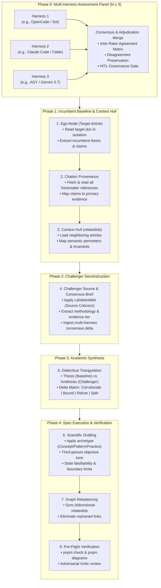
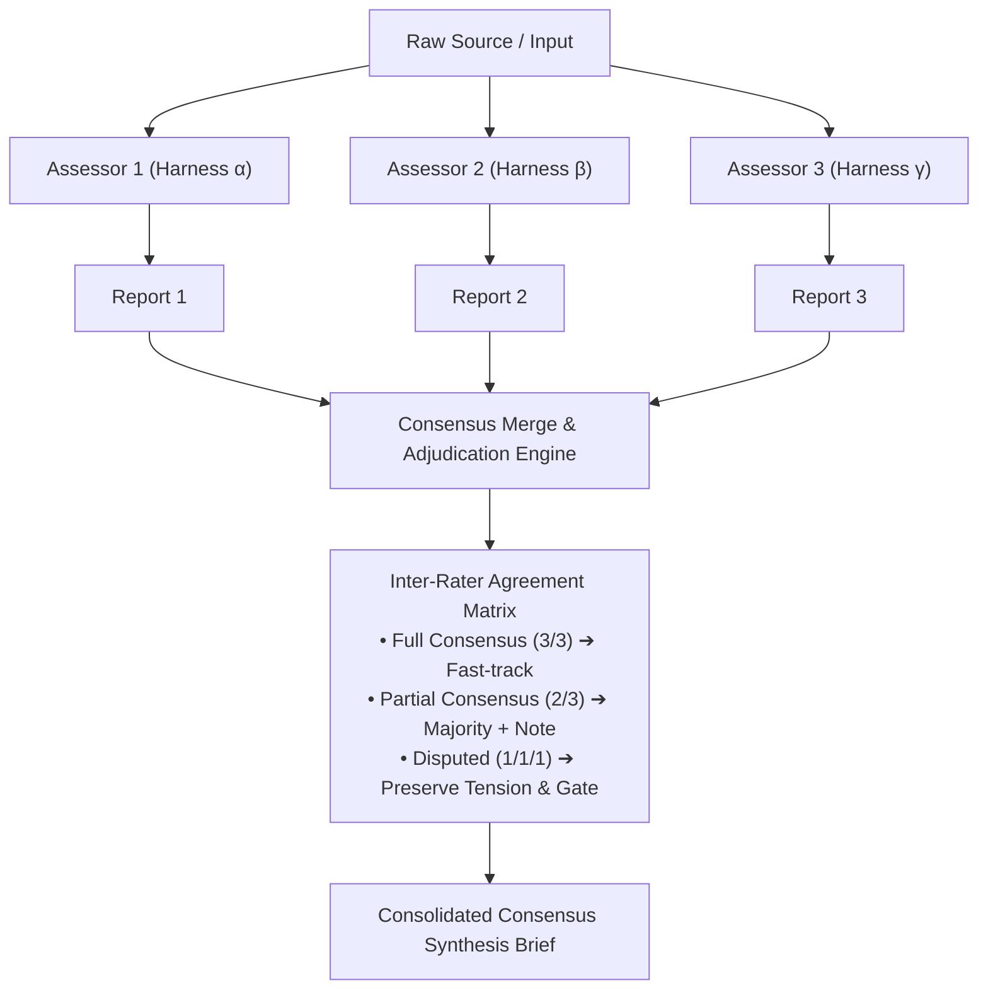
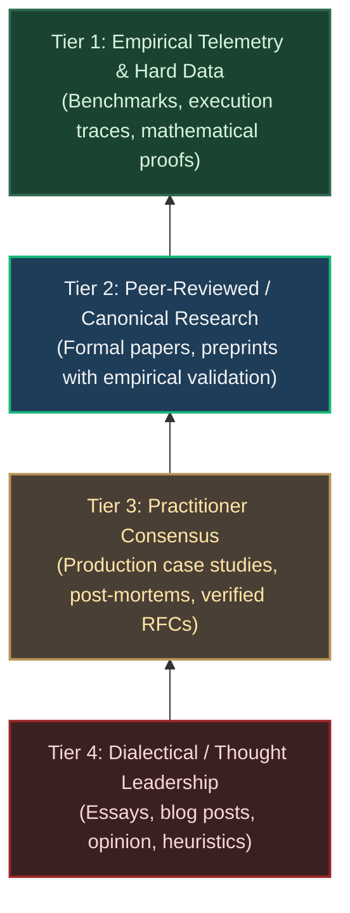
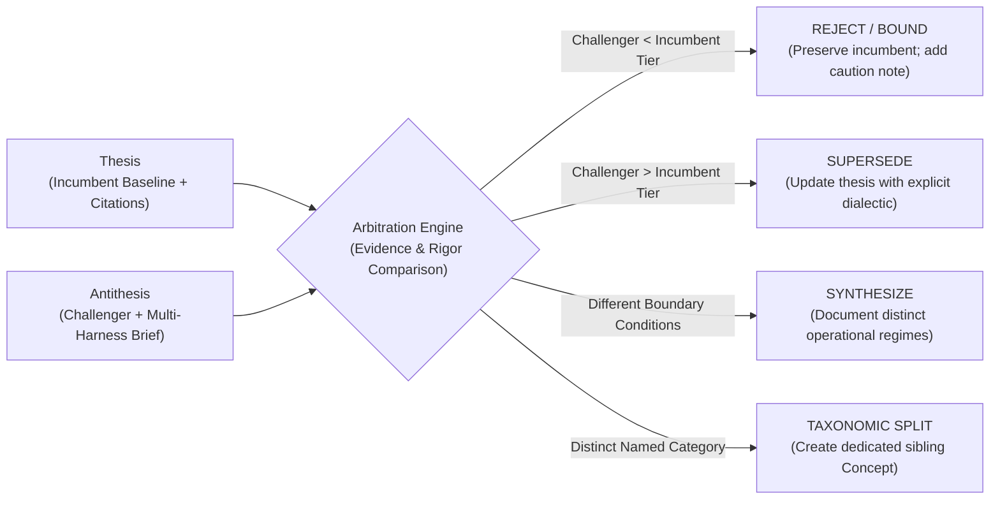
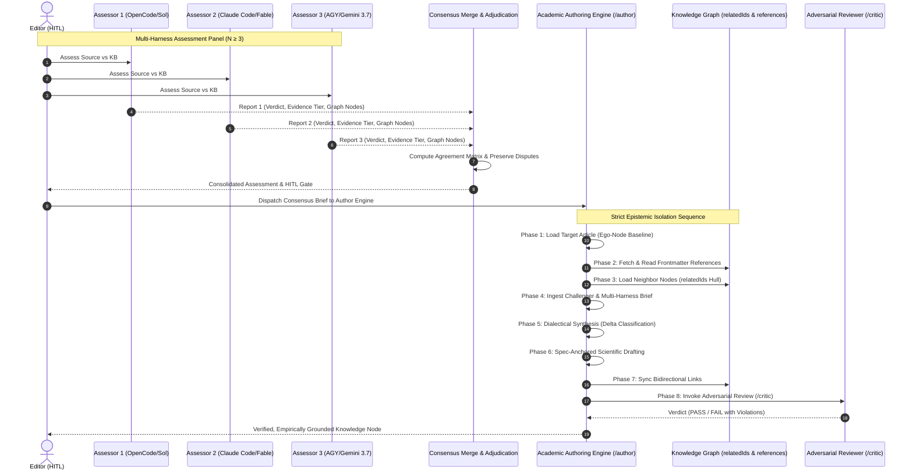
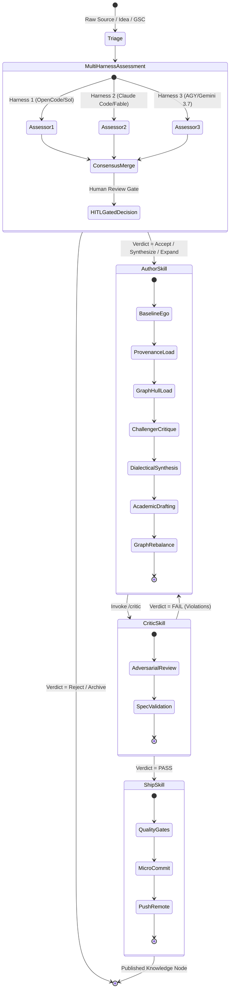

# Academic Editorial Pipeline: Scientific Synthesis & Epistemic Isolation

> **Vision:** Transform the ASDLC editorial pipeline from ad-hoc LLM text generation into a formal academic research and synthesis instrument grounded in *tieteellinen kirjoittaminen* (scientific writing), multi-harness triangulation, empirical evidence hierarchies, and strict epistemic ordering.

---

## 1. Executive Summary & Epistemic Rationale

### The Core Problem: LLM Cognitive Anchoring & Single-Model Bias
Standard AI-assisted writing workflows suffer from severe epistemic degradation:
1. **Unanchored Prompt Ingestion:** When an LLM is given an existing article alongside a new source in a single context window, it anchors on the prompt and the new source, uncritically overwriting established truths, diluting precision, and ignoring historical design rationale.
2. **Single-Model Inductive Bias:** A single agent harness/model possesses blind spots, idiosyncratic biases, and non-deterministic blinders. Relying on a single model run to assess and author critical knowledge introduces model-specific drift.
3. **Epistemic Flattening:** Traditional workflows treat all inputs equally—a tweet, a marketing blog post, a peer-reviewed paper, and production telemetry are synthesized with identical epistemic weight.
4. **Graph Blindness:** Isolated edits inadvertently violate semantic boundaries with neighboring concepts, causing conceptual duplication, one-way link breaks, or contradictory assertions across the knowledge base.

### The Solution: Epistemic Isolation & Multi-Harness Triangulation
To produce durable, citable, and empirically grounded knowledge, the pipeline enforces two foundational invariants:
1. **Heterogeneous Multi-Harness Triangulation ($N \ge 3$):** The analysis/assessment phase is executed independently across $N$ distinct agent harnesses (e.g. OpenCode/Sol, Claude Code/Fable, Antigravity/Gemini 3.7). The independent assessments are merged via a formal Consensus & Disagreement Preservation protocol.
2. **Strictly Ordered Epistemic Sequence:** The authoring engine isolates the incumbent baseline and literature provenance *before* ingesting the challenger input or consensus brief.



---

## 2. Theoretical Frameworks for Synthesis

The pipeline is built upon classical research methodology, epistemology, and scientific writing principles (*tieteellinen kirjoittaminen*):

### A. Multi-Harness Triangulation & Inter-Rater Reliability
In scientific peer review, a single referee is never sufficient to establish truth. ASDLC employs **Investigator & Harness Triangulation**:
- The assessment task is submitted in parallel to $N$ independent, heterogeneous harnesses (e.g. OpenCode, Claude Code, Antigravity).
- The harness outputs are evaluated for **Inter-Rater Reliability (IRR)** across four axes:
  1. *Classification of Evidence Tier* (Empirical vs. Opinion)
  2. *Regression Risk Assessment* (Is this a step backward?)
  3. *Action Strategy* (Integrate vs. Expand vs. Reject vs. Split)
  4. *Knowledge Graph Node Impact* (Which siblings are touched?)
- **Disagreement Preservation Principle:** If independent harnesses disagree (e.g., Harness 1 recommends "Synthesize" while Harness 2 recommends "Taxonomic Split / New Concept"), the consensus protocol does **not** average or flatten the dispute. The dialectical tension is explicitly recorded in the synthesis brief, allowing the human reviewer (HITL) or drafting agent to address both viewpoints with clear boundary conditions.



### B. Source Criticism (*Lähdekritiikki*) & Evidence Hierarchy
All inputs are categorized into a 4-tier epistemic hierarchy. Higher tiers strictly supersede lower tiers during conflict arbitration:



- **Tier 1 (Empirical Telemetry):** Direct benchmark results, runtime logs, unit-tested harness data. Ground truth.
- **Tier 2 (Peer-Reviewed / Canonical Research):** Published research (e.g. arXiv, IEEE, ACM) with documented methodologies and datasets.
- **Tier 3 (Practitioner Consensus):** Real-world industrial case studies from established engineering teams.
- **Tier 4 (Thought Leadership / Opinion):** Conceptual musings, developer blogs, social posts. Treated strictly as **hypotheses** requiring validation, never as established fact.

### C. Dialectical Arbitration (Thesis ↔ Antithesis ➔ Synthesis)
When a challenger input conflicts with the incumbent knowledge base, the agent executes dialectical arbitration rather than uncritical overwrite:



### D. Popperian Falsifiability & Boundary Conditions
Scientific writing requires that all propositions are testable and bounded:
1. **Operational Boundaries:** Where does this pattern or concept *fail*? (e.g., maximum token context, cost ceiling, concurrency limits, non-deterministic model degradations).
2. **Falsification Criteria:** What measurable metric (e.g., SWE-bench score drop, latency spike > 500ms, human-intervention rate increase) would disprove this pattern's efficacy?
3. **Semantic Demarcation:** Distinct separation between *What/Why* (Concepts), *Structure/Blueprints* (Patterns), and *How/Execution* (Practices).

---

## 3. End-to-End Pipeline Specification

The academic article authoring workflow comprises the multi-harness assessment front-end and the 8-phase epistemic authoring execution.



---

### Step 0: Multi-Harness Assessment & Consensus Adjudication

Before authoring starts, the challenger material is processed by $N$ independent harnesses:
1. **Parallel Ingestion:** Harnesses 1 through $N$ run the `/assess` skill independently against `src/content/`.
2. **Consensus Aggregation:** The meta-reviewer parses the individual assessment reports (`docs/assessments/{date}-{slug}.md`) and compiles:
   - **Consensus Verdict:** Majority or unanimous verdict (Accepted / Synthesized / Split / Rejected).
   - **Evidence Confidence Matrix:** Triangulated score across all reviewers.
   - **Graph Impact Union:** The superset of all proposed `relatedIds` and neighbor modifications.
   - **Disagreement Record:** Documented divergences in interpretation or structural recommendations.
3. **HITL Clearance Gate:** The user confirms the consolidated brief and triggers the authoring skill.

---

### Phase 1: Ego-Node Baseline Extraction

**Objective:** Understand the target article in complete isolation before any outside influence.

1. **Read Target:** Open `src/content/{concepts,patterns,practices}/<slug>.md`.
2. **Archetype Identification:** Match against `specs/content-articles/`:
   - `concept.md` (Terminology authority: definition, context, trade-offs, taxonomy).
   - `pattern.md` (Architectural blueprints: context, problem, solution, structure, diagram).
   - `practice.md` (Operational process: prerequisites, step-by-step procedure, validation).
3. **Incumbent State Extraction:**
   - Extract primary claims and underlying rationale.
   - Record current frontmatter (`title`, `longTitle`, `description`, `tags`, `status`, `relatedIds`, `references`).
   - Identify existing internal gaps or ambiguities in the text.

---

### Phase 2: Citation Provenance Audit (Literature & Data)

**Objective:** Audit the evidence supporting the incumbent article.

1. **Load `references`:** Read every entry in the target article's frontmatter `references` array:
   ```yaml
   references:
     - title: "Language Models are Few-Shot Learners"
       url: "https://arxiv.org/abs/2005.14165"
       type: "paper"
   ```
2. **Fetch and Verify Content:** Read the cited external literature (via URLs, preprints, RFCs, local sources).
3. **Evidentiary Mapping:**
   - Which specific paragraphs in the target rely on which citation?
   - What is the evidence tier (Tier 1 Empirical, Tier 2 Peer-Reviewed, Tier 3 Consensus, Tier 4 Opinion)?
   - Are any citations dead, outdated, or superseded by newer research?

---

### Phase 3: Context Hull Expansion (The Graph Neighborhood)

**Objective:** Load the neighboring nodes to protect semantic boundaries and avoid duplication.

1. **Load `relatedIds`:** Read all articles listed in the target's `relatedIds` array.
2. **Topological Mapping:**
   - What roles do neighboring nodes play?
   - Does a neighboring *Practice* already handle the execution steps of this *Concept*?
   - What shared taxonomy connects these nodes?
3. **Boundary Invariant Check:** Ensure the upcoming update will not encroach on a neighbor's domain or create conflicting terminology.

---

### Phase 4: Challenger Deconstruction (*Lähdekritiikki*) & Multi-Harness Ingestion

**Objective:** Isolate the new source and the multi-harness consensus brief with critical detachment.

1. **Ingest Consolidated Brief:** Ingest the raw challenger input alongside the Multi-Harness Consensus Brief from Step 0.
2. **Critical Source Audit (*Lähdekritiikki*):**
   - **Provenance:** Who authored it? What is their institutional affiliation or commercial incentive?
   - **Evidence Level:** Is it backed by telemetry, controlled experiments, or subjective impressions?
   - **Methodological Soundness:** What was the sample size, test harness, model version, and benchmark suite?
   - **Hidden Assumptions:** What conditions did the author take for granted (e.g., unlimited budget, specific IDE, proprietary model)?

---

### Phase 5: Dialectical Synthesis & Delta Classification

**Objective:** Synthesize Incumbent Truth (Phases 1–3) with Multi-Harness Challenger Data (Phase 4).

Evaluate the delta across five canonical operations:

| Operation | Condition | Editorial Action |
|---|---|---|
| **Corroborate** | Challenger provides newer/stronger Tier 1/2 evidence for an incumbent claim. | Add citations to `references`; refine empirical metrics; tighten definitions. |
| **Bound** | Challenger exposes edge cases or failure modes in the incumbent pattern. | Add explicit "Limitations & Boundary Conditions" or "Failure Modes" section. |
| **Refute / Supersede** | Challenger presents higher-tier empirical evidence disproving an incumbent claim. | Update the thesis; document the shift in reasoning; preserve historical context if valuable. |
| **Taxonomic Split** | Challenger introduces a distinct named category or framework. | Propose a new sibling concept/pattern; cross-link via `relatedIds`. |
| **Reject** | Challenger is lower-tier opinion contradicting verified empirical consensus. | Reject change; optionally log to `docs/assessments/` as disputed thought leadership. |

---

### Phase 6: Spec-Anchored Scientific Drafting

**Objective:** Write or update the markdown content adhering to strict scientific writing standards.

1. **Frontmatter Constraints:**
   - `title`: ≤ 40 chars (strict layout display name for cards and navigation).
   - `longTitle`: ≤ 120 chars (SEO/H1 title, e.g., `"OODA Loop for AI Agents: Observe-Orient-Decide-Act Cycle"`).
   - `description`: ≤ 200 chars (standalone definition).
   - `tags`: 2–5 industry keywords (avoid internal jargon).
   - `status`: `Live` | `Experimental` | `Draft` | `Proposed` | `Deprecated`.
   - `references`: Clean structured array of external sources.
   - `relatedIds`: Clean array of collection-prefixed internal slugs.
2. **Academic Prose Rules:**
   - Third-person, formal, passive or neutral voice.
   - Zero marketing adjectives ("revolutionary", "game-changing", "seamless", "next-gen").
   - Headings start strictly at `##` (H2).
   - Explicit operational boundary conditions and falsifiability criteria.
3. **Dual-Representation Diagrams:**
   - Write standard Mermaid code block.
   - Quote node labels containing parentheses or special characters.

---

### Phase 7: Knowledge Graph Re-Balancing

**Objective:** Maintain complete graph integrity across the ASDLC corpus.

1. **Bidirectional Link Invariant:**
   - If `src/content/concepts/a.md` lists `relatedIds: ["patterns/b"]`, open `src/content/patterns/b.md` and ensure `concepts/a` is in its `relatedIds`.
2. **Eliminate Asymmetric References:** Ensure no one-way links or dead references exist.
3. **Cross-Collection Boundary Audit:** Verify that Concepts contain no how-to recipes and Practices contain no architectural definitions.

---

### Phase 8: Quality Gates & Verification

**Objective:** Automated and adversarial verification before saving or committing.

1. **Automated Verification:**
   ```bash
   pnpm check       # Astro check + spec linter
   pnpm diagrams    # Pre-render Mermaid SVG figures
   pnpm lint        # Biome formatting and linting
   pnpm test:run    # Unit test suite
   ```
2. **Blind Adversarial Review (`/critic`):**
   - Run adversarial critic to audit the uncommitted diff against contracts, Zod schemas, and scientific rigor rules.
   - Resolve any identified regressions before clearance.

---

## 4. Integration into the ASDLC Editorial System

The academic writing skill sits at the core of the ASDLC editorial lifecycle:



---

## 5. Implementation Roadmap & Next Steps

1. **Multi-Harness Aggregation Script / Tooling:** Create a lightweight merge utility to ingest independent assessment reports from `docs/assessments/` and generate the Inter-Rater Reliability matrix.
2. **Authoring Skill Creation:** Implement `.agents/skills/author/SKILL.md` and `.claude/skills/author/SKILL.md` enforcing the 8-phase epistemic isolation protocol.
3. **Assessor Memory Writeback:** Ensure `docs/assessments/lessons.md` heuristics are loaded in Phase 1 and updated when novel synthesis patterns emerge.
4. **Automated Linting:** Integrate cross-reference validation and title length checks into `pnpm lint:specs` and pre-commit hooks.
