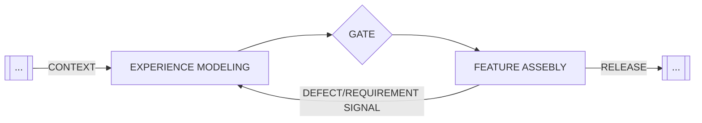

## Definition

Experience Modeling is a foundational phase of the Agentic Software Development Life Cycle (ASDLC). During this phase, we do not focus on building features; instead, we create the Experience Model—an organized design system that agents must follow. Just as we model data schemas for the backend, we also need to model the Experience Schema for the frontend. The Design System serves as the queryable model that the LLM uses to orchestrate the user interface.

## Context Gates

An explicit context gate is implemented between the Experience Modeling and Feature Assembly phases. This methodology will significantly reduce Design Drift, which is the gradual divergence of a product's actual codebase from its intended design specifications caused by the accumulation of micro-inconsistencies generated by AI.

<figure class="mermaid-diagram">
  
  <figcaption>Context Gating for Desing System Integrity</figcaption>
</figure>
