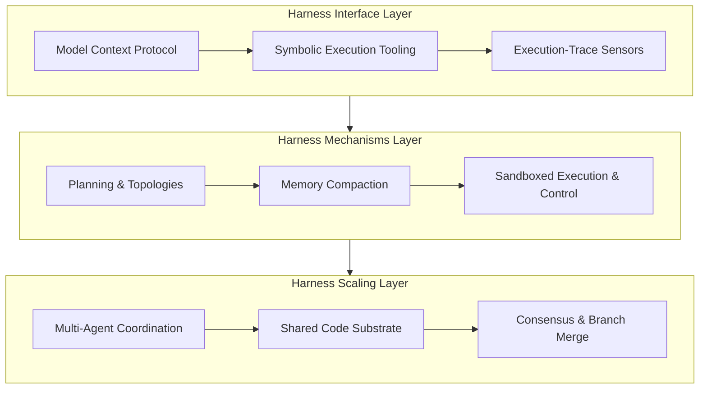

## Definition

**Harness Engineering** is the software engineering discipline focused on designing, building, and optimizing the code-based infrastructure—the operational harness—that executes, validates, and manages AI agents. 

It represents the shift from **prompt engineering** (managing the probabilistic model's internal prompt state) to **environment engineering** (building the deterministic system boundaries, state containers, and sensors that wrap the model). 

The term is popularized by Martin Fowler and practitioners at Thoughtworks, using the equestrian metaphor: a horse represents raw, unbridled power, but requires a harness (reins, bit, and saddle) to direct that power toward a specific goal. In the context of AI, the agent is represented by the formula:

$$\text{Agent} = \text{Model} + \text{Harness}$$

While the model provides the raw intelligence and reasoning, the harness provides the infrastructure, tools, memory, constraints, and feedback loops that make that intelligence useful, reliable, and safe in production.

## Key Characteristics

### 1. Guides vs. Sensors
The harness influences the model through two distinct vectors:
* **Guides (Feed-forward):** Instructions, types, schemas, system prompts, and constraints that steer the agent's behavior *before* it acts.
* **Sensors (Feedback):** Automated tests, compiler checks, linters, or evaluation metrics that observe the agent's output *after* execution, feeding warnings back into the loop to trigger self-correction before human intervention is required.

### 2. "On the Loop" vs. "In the Loop"
In a harness-engineered system, the developer's role shifts:
* **In the Loop:** The agent executing tasks and fixing code within its sandboxed workspace.
* **On the Loop:** The human engineer designing, observing, and improving the harness itself. When an agent fails, the harness engineer does not merely edit a prompt; they build a new sensor or add a deterministic validator to the harness to prevent the failure class permanently.

### 3. The Three-Layer Infrastructure
Following the framework established in *Code as Agent Harness* (Ning et al., 2026), a production-grade agentic harness consists of three structural layers:

<figure class="mermaid-diagram">
  
  <figcaption>The Three-Layer Agent Harness Architecture</figcaption>
</figure>

* **The Harness Interface Layer:** Dynamically anchors domain context and exposes standardized tool/resource interfaces (like [Model Context Protocol](/concepts/model-context-protocol)).
* **The Harness Mechanisms Layer:** Defines single-agent execution flow, memory compaction (preventing context rot), and sandboxed runtime execution.
* **The Harness Scaling Layer:** Orchestrates multi-agent coordination, branch merging, and transactional state convergence using shared code files.

## ASDLC Usage

In the Agentic Software Development Life Cycle (ASDLC), harness engineering is the foundational discipline that builds the conveyor belt of the **Software Factory** (see [Agentic SDLC](/concepts/agentic-sdlc)). 

Instead of relying on the agent's attention to follow natural language rules, we build physical jigs in the environment:
* Exposing compilers and checkers as tools, allowing the agent to delegate formal verification.
* Running agent actions in sandbox containers to protect the workspace.
* Intercepting outputs at [Context Gates](/patterns/context-gates) to parse warnings and failures into structured telemetry before the agent reads them.
