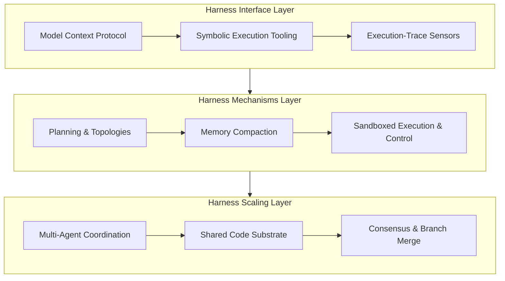

## Definition

**Harness Engineering** is the software engineering discipline focused on designing, building, and optimizing the code-based infrastructure—the operational harness—that executes, validates, and manages AI agents. 

It represents the shift from **prompt engineering** (managing the probabilistic model's internal prompt state) to **environment engineering** (building the deterministic system boundaries, state containers, and sensors that wrap the model). 

Birgitta Böckeler describes the harness as everything in an AI agent apart from the model itself, using the formulation:

$$\text{Agent} = \text{Model} + \text{Harness}$$

While the model provides the raw intelligence and reasoning, the harness provides the infrastructure, tools, memory, constraints, and feedback loops that make that intelligence useful, reliable, and safe in production.

## Key Characteristics

### 1. Guides vs. Sensors
The harness influences the model through two distinct vectors:
* **Guides (Feed-forward):** Instructions, types, schemas, system prompts, and constraints that steer the agent's behavior *before* it acts.
* **Sensors (Feedback):** Automated tests, compiler checks, linters, or evaluation metrics that observe the agent's output *after* execution, feeding warnings back into the loop to trigger self-correction before human intervention is required. Spotify's Honk agent is a production example: it runs Claude inside Spotify's own harness with CI builds across multiple operating systems as a verification tool, and lint rules encoding the organization's recommended patterns give the agent immediate feedback it corrects against. Spotify calls these "active guardrails"; in ASDLC vocabulary they are deterministic [Context Gates](/patterns/context-gates), not probabilistic steering.

### 2. "On the Loop" vs. "In the Loop"
In a harness-engineered system, the developer's role shifts:
* **In the Loop:** The agent executing tasks and fixing code within its sandboxed workspace.
* **On the Loop:** The human engineer designing, observing, and improving the harness itself. When an agent fails, the harness engineer does not merely edit a prompt; they build a new sensor or add a deterministic validator to the harness to prevent the failure class permanently.

### 3. Harness Model-Specificity and Self-Tuning
Harness design is inherently model-specific. Because different LLMs exhibit distinct reasoning habits, tool preferences, and error modes, a harness optimized for one model may be suboptimal or counterproductive for another. 

Recent research (Zhang et al., 2026) demonstrates that agents can participate in reshaping their own harness under a bounded validation loop. By mining execution traces for model-specific failure patterns (Weakness Mining) and proposing targeted adjustments (Harness Proposal), the agent customizes the environment to its own base model. However, to prevent uncontrolled behavioral drift, these agent-proposed edits must be validated against strict, deterministic regression testing (Proposal Validation) before promotion.

### 4. The Three-Layer Infrastructure
The survey *Code as Agent Harness* (Ning et al., 2026) organizes agent infrastructure into three connected layers:

```mermaid
%% caption: The Three-Layer Agent Harness Architecture
graph TD
    subgraph HS [Harness Scaling Layer]
        A[Multi-Agent Coordination] --> B[Shared Code Substrate]
        B --> C[Consensus & Branch Merge]
    end
    subgraph HM [Harness Mechanisms Layer]
        D[Planning & Topologies] --> E[Memory Compaction]
        E --> F[Sandboxed Execution & Control]
    end
    subgraph HI [Harness Interface Layer]
        G[Model Context Protocol] --> H[Symbolic Execution Tooling]
        H --> I[Execution-Trace Sensors]
    end
    HI --> HM
    HM --> HS
```

<figure class="mermaid-diagram">
  
  <figcaption>The Three-Layer Agent Harness Architecture</figcaption>
</figure>

* **The Harness Interface Layer:** Dynamically anchors domain context and exposes standardized tool/resource interfaces (like [Model Context Protocol](/concepts/model-context-protocol)).
* **The Harness Mechanisms Layer:** Defines single-agent execution flow, memory compaction (preventing context rot), and sandboxed runtime execution.
* **The Harness Scaling Layer:** Orchestrates multi-agent coordination, branch merging, and transactional state convergence using shared code files.

## ASDLC Usage

In the Agentic Software Development Life Cycle (ASDLC), harness engineering is the foundational discipline that builds the conveyor belt of the **Software Factory** (see [Agentic SDLC](/concepts/agentic-sdlc)). 

Instead of relying on the agent's attention to follow natural language rules, we build physical jigs in the environment:
* Exposing compilers and checkers as tools, allowing the agent to delegate formal verification.
* Running agent actions in sandbox containers to protect the workspace.
* Intercepting outputs at [Context Gates](/patterns/context-gates) to parse warnings and failures into structured telemetry before the agent reads them.
