## Definition

The **Levels of Autonomy** scale categorizes engineering AI systems based on their operational independence, deterministic execution boundaries, and required human oversight. Inspired by the SAE J3016 automotive framework, this taxonomy clarifies that **AI autonomy levels** are not subjective metrics of model intelligence—they are formal classifications of operational risk, cognitive load distribution, and architectural guardrails.

The scale dictates precisely where the [Context Gate](/patterns/context-gates) must be positioned. By formalizing these stages, organizations can transition away from ad-hoc "vibe coding" and establish measurable verification pipelines that control technical, cognitive, and intent debt.

## The Autonomy Scale Matrix

| Level | Designation | Description | Human Role | Failure Mode |
| :--- | :--- | :--- | :--- | :--- |
| **L1** | Assistive | Inline autocomplete, reactive chat. Zero state retention. | **Driver.** Hands on wheel 100% of the time. | Distraction, inline syntax errors, hallucinated parameters. |
| **L2** | Task-Based | Single-file modifications with bounded context execution. | **Reviewer.** Sync-checks and manual diff approval before commit. | Isolated logic bugs, localized technical debt accumulation. |
| **L3** | Conditional | Multi-file orchestration via automated loops and specs. | **Change Owner.** Async validation of CI/CD and intent drift. | Regression to the mean, silent architectural mediocrity. |
| **L4** | High | Self-directed backlog execution and multi-agent planning. | **Auditor.** Post-hoc telemetry analysis and periodic realignment. | **Silent Drift.** Code compiles but diverges from intent. |
| **L5** | Full | Decentralized software systems operating without human loops. | **Consumer.** Passive beneficiary of software output. | Systemic alignment failure, irreversible technical bankruptcy. |

## Shifting Context Gate Boundaries

```mermaid
%% caption: Shifting Context Gate Boundaries from L1 to L5 Autonomy
graph TD
    subgraph L1 [L1: Assistive]
        direction LR
        L1_AI[AI Autocomplete/Chat] -->|Line/Token| L1_Gate[Context Gate]
        L1_Gate -->|Immediate review| L1_Human([Human Driver])
    end
    subgraph L2 [L2: Task-Based]
        direction LR
        L2_AI[AI Command/Tool] -->|Single File| L2_Gate[Context Gate]
        L2_Gate -->|Diff inspection| L2_Human([Human Reviewer])
    end
    subgraph L3 [L3: Conditional]
        direction LR
        L3_Loop[AI Autonomous Loop] -->|Multi-file CI/CD validation| L3_Gate[Context Gate]
        L3_Gate -->|PR approval / Intent verification| L3_Human([Human Change Owner])
    end
    subgraph L4 [L4: High]
        direction LR
        L4_Backlog[AI Backlog Execution] -->|Loose goals / Hotspots| L4_Telemetry[Telemetry Audit]
        L4_Telemetry --> L4_Human([Human Auditor])
    end
    subgraph L5 [L5: Full]
        direction LR
        L5_Self[Closed Evolution Loop] --> L5_End([Human Consumer])
    end
```



<figure class="mermaid-diagram">
  
  <figcaption>Shifting Context Gate Boundaries from L1 to L5 Autonomy</figcaption>
</figure>

## Detailed Level-by-Level Breakdown

### Level 1: Assistive Autonomy

- **Definition:** The AI operates exclusively as a reactive, stateless assistant. It cannot initiate execution loops, alter files independently, or retain context across sessions. It relies entirely on immediate human prompts.
- **Real-World Referent:** Inline ghost-text autocompletion or an open chat sidebar within an IDE where an engineer manually copies and pastes snippets into a single document.
- **Engineering Artifact:** A basic, stateless API request payload where the human remains the exclusive state coordinator.

```json
{
  "model": "gemma-4-9b-it-local",
  "messages": [
    {"role": "user", "content": "Complete this TypeScript function signature: function calculateTotal(items: CartItem[]): number {"}
  ],
  "temperature": 0.0,
  "max_tokens": 32
}
```

### Level 2: Task-Based Autonomy

- **Definition:** The system can read and write to an isolated file or bounded context to execute a single, discrete task. The human must explicitly trigger the tool, bound its input space, and review the code before it passes into source control.
- **Real-World Referent:** A developer running a localized terminal command to refactor a specific utility class using an intentional prompt hook, where the output is generated directly into the working directory for git diff inspection.
- **Engineering Artifact:** A deterministic tool-calling schema constraining the agent to single-file write operations.

```yaml
tool_spec:
  name: "modify_single_file"
  description: "Applies localized code fixes to a targeted file paths within the current workspace."
  parameters:
    type: "object"
    properties:
      target_file: 
        type: "string"
        pattern: "^src/utils/[a-zA-Z0-9_-]+\\.ts$"
      explanation_of_fix:
        type: "string"
    required: ["target_file", "explanation_of_fix"]
```

### Level 3: Conditional Autonomy (The Production Ceiling)

- **Definition:** The system orchestrates multi-file changes using execution loops, self-correction capabilities, and targeted validation suites. It evaluates its own work against strict schemas, but cannot modify the underlying definition of success. The agent operates autonomously *until* a predefined limit is breached, requiring a human [Context Gate](/patterns/context-gates) review to merge changes.
- **Real-World Referent:** A specialized agent harness tracking an issue ticket, generating an implementation plan based on [The Spec](/patterns/the-spec), running local test suites via a compound loop, fixing its own linter errors, and submitting a pull request for human verification.
- **Engineering Artifact:** An automation engine configuration defining an explicit step-by-step verification pipeline and strict token/monetary safety caps.

```json
{
  "pipeline_id": "asdlc-feature-implementation",
  "target_version": "L3-conditional",
  "max_execution_loops": 5,
  "verification_steps": [
    "biome check --write src/",
    "vitest run --coverage"
  ],
  "context_gate": {
    "require_human_signoff": true,
    "block_on_failures": true,
    "destination": "github-pull-request-review"
  }
}
```

### Level 4: High Autonomy

- **Definition:** The agent operates across broad, loosely defined goals over an extended time horizon. It manages its own task lists, makes architectural trade-offs, and delegates sub-tasks to subordinate agent systems. Human oversight transitions from proactive gatekeeping to reactive auditing.
- **Real-World Referent:** An autonomous software sub-system assigned to clean up structural technical debt across a large repository, running over a weekend without human intervention, deciding which files to refactor based on hotspot telemetry analysis.
- **Engineering Artifact:** A high-level intent-tracking manifest where the agent monitors its own drift metrics and handles post-hoc auditing telemetry.

```yaml
agent_session:
  id: "debt-mitigation-loop-094"
  autonomy_tier: "L4"
  objective: "Refactor legacy telemetry modules to adhere to 2026 system patterns"
  telemetry_metrics:
    cognitive_debt_score: "monitored"
    intent_drift_tolerance: 0.12
  audit_log_endpoint: "/var/log/asdlc/audit/session_094.log"
  action_on_drift_breach: "halt_and_notify_auditor"
```

### Level 5: Full Autonomy

- **Definition:** The AI operates without human intervention, boundaries, or structural safety overrides. The system dynamically defines its own requirements, responds to live production metrics, provisions its own computing resources, and mutates its own core architecture autonomously.
- **Real-World Referent:** A theoretical decentralized software swarm that registers domains, builds applications, evaluates market fit based on real-time revenue analytics, and rewrites its own codebase dynamically without human engineering presence.
- **Engineering Artifact:** A completely closed-loop state machine where the agent possesses authority to alter its own execution infrastructure and validation metrics.

```json
{
  "system_mode": "L5-autonomous-evolution",
  "human_in_the_loop": false,
  "self_mutation_allowed": true,
  "resource_allocation": {
    "max_budget_usd": "unbounded",
    "infrastructure_provider": "localized-edge-mesh"
  }
}
```

## Analogy: The Self-Driving Standard (SAE)

To understand how human oversight scales across these tiers, we can map the software engineering lifecycle directly onto the vehicle automation standards defined by SAE J3016.

| ASDLC Level | SAE Equivalent | The "Steering Wheel" Metaphor |
| :--- | :--- | :--- |
| **L1: Assistive** | L1 (Driver Assist) | **Hands On, Feet On.** The AI nudges the wheel (Lane Keep Assist), but the human remains the primary operator manipulating code lines. |
| **L2: Task-Based** | L2 (Partial Automation) | **Hands On (mostly).** The AI manages the vehicle's position for short durations. The human constantly monitors the immediate environment to intercept logic bugs. |
| **L3: Conditional** | L3 (Conditional Automation) | **Hands Off, Eyes On.** The AI executes the entire drive maneuver across multiple systems. The human steps away from direct labor but remains the Change Owner, ready to take control if an unexpected exception occurs. |
| **L4: High** | L4 (High Automation) | **Mind Off.** The human is sleeping in the back seat while the vehicle operates within a geo-fenced region. This setup creates a massive cognitive debt liability if the fence constraints degrade. |
| **L5: Full** | L5 (Full Automation) | **No Steering Wheel.** The vehicle lacks manual user controls. The codebase evolves past human legibility, introducing total alignment vulnerability. |

## ASDLC Framework Applications

The [Agentic SDLC (ASDLC)](/concepts/agentic-sdlc) framework focuses heavily on perfecting governance and infrastructure for **Level 3 (Conditional Autonomy)**. While industry hyperbole regularly skips directly to L5, treating full autonomy as an immediate goal introduces unmanageable intent and cognitive debt.

### The Level 3 Production Ceiling

L3 represents the balance between operational scaling and engineering safety. Pushing systems into L4 without an advanced, isolated [AI Software Factory](/concepts/ai-software-factory) environment exposes the enterprise to severe risks:

- **The Paradox of Supervision:** As agents operate with longer periods of isolation, human engineering skills atrophy. When an L4 agent experiences an edge-case failure, the human auditor lacks the immediate contextual clarity to intervene effectively.
- **Silent Drift:** L4 and L5 agents can continuously generate code that compiles successfully and passes naive unit checks while slowly deviating from strategic product goals. This creates a state of **unpriced liability**, where system complexity outpaces human comprehension.

By formalizing strict validation loops and keeping human engineers positioned squarely at the gate as **Change Owners**, teams can safely maximize agentic throughput while enforcing deterministic engineering standards.

### Linked Framework Concepts

- [Agentic SDLC](/concepts/agentic-sdlc) — The foundational engineering methodology enclosing the autonomy matrix.
- [Context Gates](/patterns/context-gates) — The concrete verification gates that enforce L3 boundaries.
- [The Spec](/patterns/the-spec) — The living specification document that provides the source of truth for intent and verification.
