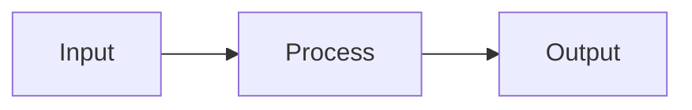
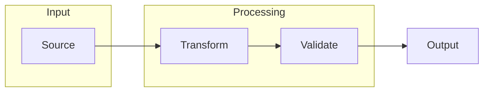

## Definition

Mermaid is a text-based diagramming language that renders flowcharts, sequence diagrams, and architecture visualizations from markdown-style code blocks. In agentic development, Mermaid serves as the specification language for processes, workflows, and system relationships.

Where [Gherkin](/concepts/gherkin) specifies *behavior* and [YAML](/concepts/yaml) specifies *structure*, Mermaid specifies *process*—how components interact, how data flows, and how state transitions occur.

## Key Characteristics

### Text-Based Diagrams

Mermaid diagrams are defined in plain text, making them:
- **Version-controllable** — Diagram changes appear in diffs
- **Reviewable** — Same PR process as code
- **Agent-parseable** — LLMs can read and modify diagrams

<figure class="mermaid-diagram">
  
  
</figure>

### Diagram Types

| Type | Use Case | ASDLC Application |
|------|----------|-------------------|
| **Flowchart** | Process flows, decision trees | Feature Assembly, Context Gates |
| **Sequence** | API interactions, message flows | Service contracts, Integration specs |
| **State** | State machines, lifecycle | Component state, Workflow phases |
| **Class** | Object relationships | Domain models, Architecture |
| **ER** | Entity relationships | Data models, Schema design |
| **Gantt** | Timeline, scheduling | Roadmaps, Sprint planning |

### Subgraphs for Grouping

Subgraphs partition complex diagrams into logical regions:

<figure class="mermaid-diagram">
  
  
</figure>

## ASDLC Usage

Mermaid serves as the **process specification language** in ASDLC, completing the specification triad:

| Language | Specifies | Example |
|----------|-----------|---------|
| **[Gherkin](/concepts/gherkin)** | Behavior | Given/When/Then scenarios |
| **[YAML](/concepts/yaml)** | Structure | Schemas, configuration |
| **Mermaid** | Process | Flowcharts, sequences |

**Why Mermaid for Specs:**

Text-based diagrams solve a critical problem in agentic development: visual documentation that agents can read, modify, and version-control. Unlike image-based diagrams that become stale context, Mermaid diagrams are:

- **Agent-modifiable** — LLMs can update flows as requirements change
- **Diffable** — Changes appear in code review alongside logic changes
- **Living** — Part of the spec, not a separate artifact that drifts

**Relationship to Patterns:**

- **[The Spec](/patterns/the-spec)** — Specs embed Mermaid to visualize feature architecture and state flows
- **[Context Engineering](/concepts/context-engineering)** — Diagrams as structured, machine-readable context

## Anti-Patterns

| Anti-Pattern | Description |
|--------------|-------------|
| **Box Soup** | Too many nodes without grouping |
| **Arrow Spaghetti** | Excessive cross-connections |
| **No Labels** | Edges without descriptive text |
| **Static Screenshots** | Images instead of text diagrams |

> [!TIP]
> **Key practices:** Group with subgraphs, label edges, use `flowchart LR` for process flows, limit to <15 nodes per diagram.

