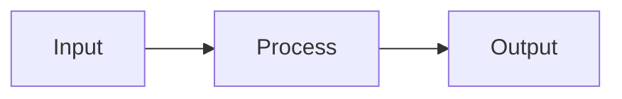
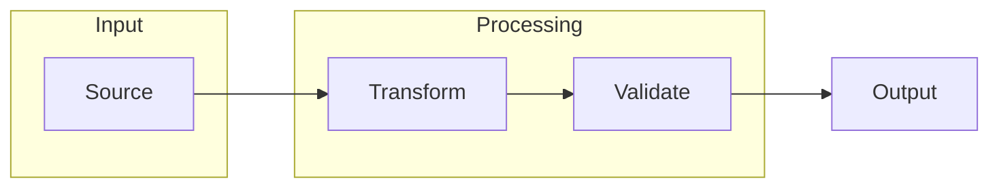

## Definition

Mermaid is a text-based diagramming language that renders flowcharts, sequence diagrams, and architecture visualizations from markdown-style code blocks. In agentic development, Mermaid serves as the specification language for processes, workflows, and system relationships.

Where [Gherkin](/concepts/gherkin) specifies *behavior* and [YAML](/concepts/yaml) specifies *structure*, Mermaid specifies *process*—how components interact, how data flows, and how state transitions occur.

## Key Characteristics

### Text-Based Diagrams

Mermaid diagrams are defined in plain text, making them:
- **Version-controllable** — Diagram changes appear in diffs
- **Reviewable** — Same PR process as code
- **Agent-parseable** — LLMs can read and modify diagrams



<figure class="mermaid-diagram">
  
  
</figure>

### Diagram Types

| Type | Use Case | ASDLC Application |
|------|----------|-------------------|
| **Flowchart** | Process flows, decision trees | Feature Assembly, Context Gates |
| **Sequence** | API interactions, message flows | Service contracts, Integration specs |
| **State** | State machines, lifecycle | Component state, Workflow phases |
| **Class** | Object relationships | Domain models, Architecture |
| **ER** | Entity relationships | Data models, Schema design |
| **Gantt** | Timeline, scheduling | Roadmaps, Sprint planning |

### Subgraphs for Grouping

Subgraphs partition complex diagrams into logical regions:



<figure class="mermaid-diagram">
  
  
</figure>

## Mermaid in ASDLC

### Spec Diagrams

The [Spec](/patterns/the-spec) pattern uses Mermaid to visualize feature architecture and assembly flows. Diagrams are embedded in markdown and rendered to SVG via `pnpm diagrams`.

### Design System Integration

ASDLC diagrams use the Avionics design system palette:

| Element | Color | Token |
|---------|-------|-------|
| Nodes | `#f04e30` | `--c-brand` |
| Subgraphs | `#ebebe6` | `--c-bg-surface` |
| Borders | `#d1d1c7` | `--c-border` |
| Text | `#111111` | `--c-text-primary` |

Configuration lives in `mermaid.json` at the project root.

### Generation Workflow

1. Write ` ```mermaid ` code block in markdown
2. Run `pnpm diagrams` to generate SVG
3. Script outputs to `public/mermaid/{slug}-fig-{n}.svg`
4. Script adds `<figure>` reference after the mermaid block

This produces static SVGs that render consistently across browsers and export cleanly to PDF.

## ASDLC Usage

Mermaid serves as the **process specification language** in ASDLC, completing the specification triad:

| Language | Specifies | Example |
|----------|-----------|---------|
| **[Gherkin](/concepts/gherkin)** | Behavior | Given/When/Then scenarios |
| **[YAML](/concepts/yaml)** | Structure | Schemas, configuration |
| **Mermaid** | Process | Flowcharts, sequences |

Applied in:
- [The Spec](/patterns/the-spec) — Assembly flow diagrams
- [Context Engineering](/concepts/context-engineering) — Context flow visualization
- Design System — Component documentation

## Anti-Patterns

| Anti-Pattern | Description | Failure Mode |
|--------------|-------------|--------------|
| **Box Soup** | Too many nodes without grouping | Unreadable; no hierarchy |
| **Arrow Spaghetti** | Excessive cross-connections | Confusing; hard to follow |
| **No Labels** | Edges without descriptive text | Ambiguous relationships |
| **Static Screenshots** | Images instead of text diagrams | Not version-controllable; decay |
| **Over-Detailed** | Including implementation details | Noise; maintenance burden |

## Best Practices

1. **Group with Subgraphs** — Partition logical regions for clarity
2. **Label Edges** — Describe what flows between nodes
3. **Left-to-Right Flow** — Use `flowchart LR` for process flows
4. **Top-to-Bottom Hierarchy** — Use `flowchart TB` for hierarchies
5. **Limit Complexity** — If a diagram needs >15 nodes, split it
6. **Use Design Tokens** — Configure colors via `mermaid.json`, not inline
