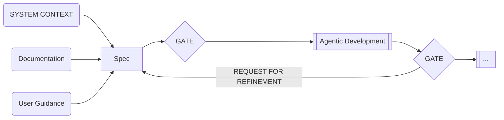

## Definition

Spec-Driven Development (SDD) means defining the "What" and the "Why" first. This is done in precise, machine-readable formats. Only then does an AI agent address the "How."

SDD inverts control. Instead of code serving as the source of documentation, the Spec becomes the authority. Code must then fulfill this Spec.

In the era of Agentic tools, SDD addresses the issue of "vibe coding," in which LLMs generate code from vague prompts. By grounding workflows in schemas, state machines, and contracts, SDD converts probabilistic outputs into reliable engineering artifacts.

> [!WARNING]
> **The Figma Trap**
> A beautiful mockup is not a specification; it is a suggestion. Mockups typically demonstrate the "happy path" but hide the edge cases, error states, and data consistency strictures where production bugs live.
>
> **Never** treat a visual design as a complete technical requirement. AI agents given only mockups will hallucinate implementations for the missing logical layers.

## SDD in the ASDLC

In the Agentic Software Development Life Cycle (ASDLC), we suggest using SDD as a comprehensive lifecycle-constraint system rather than merely for code generation. Specifications generate code, model the domain, and enforce architectural governance.

Our methodology separates context to prevent misalignment:

1. The Agent Constitution (Global Context): A permanent set of rules, such as "Use safe databases" or "Store all info in one place." This makes sure everything created by the system meets company guidelines.
2. The Docs (Reference Context): Long-term, stable documentation like Product Requirements Documents (PRDs) or earlier Specs that explain the overall goals and constraints.
3. The Spec (Local Context): A short-term, targeted set of instructions for a task, used to validate immediate results.

## Accessibility: Specs as Source Code

In ASDLC, Product Requirements Documents (PRDs), tasks, and Specs are treated like Source Code. The AI must be able to read Specs directly, not just see them in pictures or separate documents.

To make this happen, we either use the Model Context Protocol (MCP) or put the specs right next to the code:

* Repository Colocation: Storing specs as Markdown or YAML files directly in the git repository (e.g., .specs/feature-login.md). This ensures that the version history matches the code history.
* MCP Integration: Use MCP to connect to external tools (e.g., Linear or Jira) so the AI can read tasks as clear instructions.

## Context Gates

ASDLC formalizes the classic SDD step-by-step process with strict context gates. Spec updates and handoffs should occur strictly through HITL (human-in-the-loop) gates.

<figure class="mermaid-diagram">
  
  <figcaption>Context Gating of Spec-Driven Development</figcaption>
</figure>
