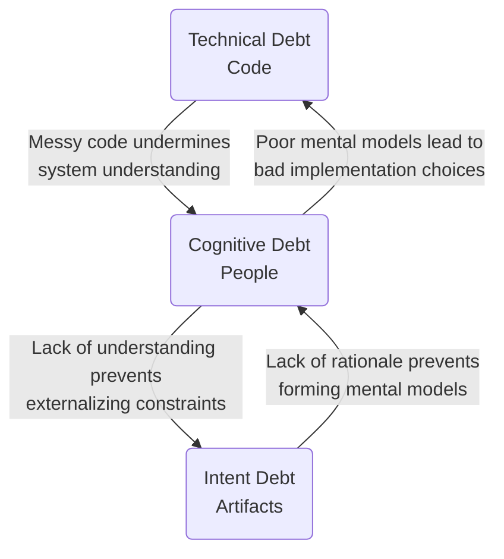

## Definition

The **Triple Debt Model** is a unified diagnostic framework for reasoning about software system health. Formulated by Margaret-Anne Storey et al., it expands the traditional concept of technical debt to account for the unique failure modes introduced by generative AI and agentic software development.

The model posits that system health degrades across three interconnected vectors: **Technical Debt** (in code), **Cognitive Debt** (in people), and **Intent Debt** (in externalized artifacts). While AI accelerates code creation—often reducing syntax-level technical debt—it simultaneously drives an exponential increase in cognitive and intent debt if not strictly governed.

## The Three-Layer System Model

A software system is not just source code. It exists across three distinct layers, each capable of accumulating its own form of debt:

1. **Software (Code)**: The running application and executable logic.
2. **People (Understanding)**: The shared mental models, domain knowledge, and operational understanding held by the human team.
3. **Artifacts (Intent)**: The externalized rationale, decisions, constraints, and specifications that exist outside of both the code and the developers' minds.

System health requires continuous alignment across all three layers.

## Technical Debt: The Visible Layer

- **Domain**: Lives in Code.
- **Definition**: Suboptimal implementation choices (e.g., duplicated logic, missing tests, poor performance) that compromise future maintainability.
- **AI Impact**: Generative AI shows tremendous promise for *reducing* technical debt through automated refactoring, code generation from specs, and comprehensive test suite creation. It is the best-understood and most measurable debt type.

## Cognitive Debt: The Invisible Layer

- **Domain**: Lives in People.
- **Definition**: The erosion of a team's shared mental models and operational understanding of the system they maintain.
- **Cognitive Surrender vs. Cognitive Offloading**:
  - **Cognitive Offloading** is strategic and healthy: delegating rote tasks (syntax generation, boilerplate) to an agent to free up mental capacity for higher-level architectural reasoning.
  - **Cognitive Surrender** (Shaw & Nave, 2026) is pathological: adopting AI outputs with minimal scrutiny and bypassing both intuition and deliberate reasoning entirely. The human accepts the code without understanding its implications.
- **Diagnostic Indicators**: Severe resistance to making architectural changes, unexpected production results, extremely low bus factor, developer burnout, and unusually slow onboarding of new team members who cannot comprehend the AI-generated maze.

## Intent Debt: The Forgotten Layer

- **Domain**: Lives in Artifacts.
- **Definition**: The absence of externalized rationale, context, and constraints. It occurs when decisions are made (by humans or AIs) but the *why* and *how* are never documented in a machine-readable or human-readable format.
- **Characteristics**: Practitioner terms like "context debt" are symptoms of systemic Intent Debt. Intent is inherently ephemeral; it is best captured at the exact moment of decision (e.g., during the [Learning Loop](/concepts/learning-loop)). Unlike technical debt, lost intent cannot always be reverse-engineered later. Once intent is gone, any future modifications are blind guesses.

## Interaction Dynamics

The three debt types do not exist in isolation. They form a bidirectional web where debt in one layer accelerates decay in the others:

<figure class="mermaid-diagram">
  
  
</figure>

## How AI Shifts the Balance

In pre-AI development, the sheer friction of writing code manually forced a feedback loop. Translating an idea into syntax required the developer to deeply *understand* the system (reducing Cognitive Debt) and continuously hold the constraints in their mind (managing Intent Debt). 

Generative AI bypasses this cognitive bottleneck. By drastically lowering the cost of execution, AI removes the friction that traditionally forced understanding. The result is a shift in the debt balance: AI minimizes Technical Debt but supercharges Cognitive and Intent Debt, leading to [Legacy Code in record time](/concepts/vibe-coding).

## ASDLC Usage

The Agentic Software Development Life Cycle (ASDLC) is fundamentally designed to mitigate the Triple Debt Model through formal operational constraints. 

Our mapping to the mitigation hierarchy:

*   **Mitigating Intent Debt**: ASDLC mandates "intent-first" workflows. Intent Debt is primarily combatted through the [Agent Constitution](/patterns/agent-constitution) (project-level intent), [The Spec](/patterns/the-spec) (feature-level intent), [ADRs](/patterns/the-adr) (decision rationale), and [BDD Scenarios](/concepts/behavior-driven-development) (executable intent).
*   **Mitigating Cognitive Debt**: Addressed through [Human-in-the-Loop](/concepts/levels-of-autonomy) reviews, the [Learning Loop](/concepts/learning-loop), and [Adversarial Requirement Reviews](/practices/adversarial-requirement-review). Crucially, the *process* of authoring and refining a specification builds genuine cognitive alignment across the team.
*   **Mitigating Technical Debt**: Controlled via [Context Gates](/patterns/context-gates), deterministic automated verification, and AI-assisted continuous refactoring.

> [!WARNING]
> **Resist the Automation of Understanding**
> 
> Generating artifacts, documentation, and specifications entirely via AI without deep human engagement is a catastrophic anti-pattern. It "substitutes the appearance of understanding for the real thing." Artifacts must represent true human intent, not just another layer of generative hallucination.
