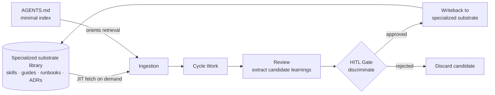

## Definition

The compound-loop is a structural pattern in which each cycle of iterative work produces both an artifact and candidate machine-readable learnings about producing it. The learnings cross a human-in-the-loop gate before being persisted to specialized, scoped context artifacts; the next cycle ingests those artifacts on demand rather than loading the team's full accumulated memory. Where the task-scale [ralph-loop](/patterns/ralph-loop) accumulates context within a single task until convergence, the compound-loop accumulates context across many tasks with discrimination at the gate and restraint in the retrieval.

## The Problem

Iterative software development produces two outputs at each cycle: the artifact and the operational knowledge of producing it. The artifact is preserved by default — it is the deliverable. The operational knowledge is not, and the failure modes that follow have a particular shape under agentic conditions.

Three failure modes compound when no structural mechanism handles cycle-level learnings:

- **Each cycle starts from zero.** Framework quirks discovered in cycle N — the auth provider's rate-limit, the webhook's at-least-once delivery, the framework's thirty-second timeout — live only in the head of whoever did the work. Cycle N+1's agent rediscovers them, often expensively. The codebase grows; the team's expertise about the codebase does not.

- **Autonomous writeback compounds the wrong things.** When agents are allowed to write their own learnings back to persistent context without discrimination, the substrate accumulates *what the agent did*, not *what the team should have learned*. Intent Debt accumulates: increasingly polished context drifting from original intent. This is the failure mode that distinguishes naive compounding from disciplined compounding.

- **Monolithic context bloats and stops compounding.** When every learning is dumped to a single context file — a large `AGENTS.md`, a long `CLAUDE.md`, an ever-growing project doc — the file becomes too large for an agent to use as context. Signal gets lost in volume. Each new cycle's agent ingests megabytes of accumulated lore to do a small task. The substrate that was meant to accelerate work begins to obstruct it.

Naive solutions share two defects: they either let agents write whatever they discover (Intent Debt), or they pile everything into one always-loaded file (context bloat). Neither produces compounding. Both produce decay disguised as accumulation.

## The Solution

The structural response has three coupled moves: discrimination at the compound step, externalization in the storage, and just-in-time in the retrieval.

**Discrimination at the compound step.** Candidate learnings extracted at cycle close cross a human-in-the-loop gate before persistence. The gate asks: is this true? generalizable? not already documented? not contradicted by existing context? Worth the future agent's attention? Only approved candidates get written back. This sits naturally at L3 autonomy: agents propose; humans gate.

**Externalization in the storage.** Approved learnings are written to *specialized*, *scoped* artifacts — skills, guides, runbooks, architecture decision records — each holding a particular kind of knowledge. Third-party API quirks belong in an API-quirks skill. Deployment idiosyncrasies belong in a deployment runbook. Architectural choices belong in ADRs. The top-level `AGENTS.md` stays minimal: it is an index and orienting pointer, not a dumping ground.

**Just-in-time in the retrieval.** The next cycle's agent does not load everything. It loads the minimal `AGENTS.md` and follows the index to fetch the specific specialized artifact the current work actually needs. A cycle implementing a webhook handler fetches the webhook-quirks skill. A cycle implementing a deployment fetches the deployment runbook. The team's full accumulated knowledge is *available* without being *always loaded*.

The structural insight: the workspace is the team's procedural memory, but the memory is organized. Storage is distributed and scoped; retrieval is on-demand and contextual; writeback is gated. Discrimination at one end, externalization in the middle, JIT at the other. Together they distinguish compounding from accumulation.

## Anatomy and Structure

The compound-loop has five structural components and one reinforcing relationship across cycles.

<figure class="mermaid-diagram">
  
  <figcaption>The Compound Loop: gated writeback to a specialized substrate, JIT retrieval into the next cycle</figcaption>
</figure>

**Specialized substrate library.** A workspace-local collection of scoped knowledge artifacts: skills documenting particular tools or APIs, guides explaining workflows, runbooks for operations, architecture decision records, convention docs. Each artifact has a defined scope and stays focused within it. The library lives inside the repository, versioned alongside the code.

**Minimal index.** A top-level orienting document — typically `AGENTS.md` at the repository root — that names what scoped artifacts exist and when to consult them. The index stays small enough to always load. Its purpose is to make the rest of the library discoverable, not to hold the knowledge itself.

**Cycle work.** The bounded unit of iteration: a feature, a refactor, a fix. The cycle has a recognizable start (intent to work) and end (the artifact is accepted, rejected, or paused).

**Human-in-the-loop gate.** The discrimination point that sits between candidate learnings and persistence. The gate is where editorial judgment lives: which candidates are real, generalizable, not already documented, and worth a future agent's attention. The gate is a deterministic checkpoint in an otherwise probabilistic workflow — it is where Intent Debt is prevented from compounding.

**JIT context-fetching mechanism.** The means by which the next cycle's agent retrieves the relevant specialized artifact when the current work demands it. The mechanism may be a literal include directive, a tool that reads on request, or a convention the operator follows. The structural requirement is that retrieval is *contextual*, not blanket — the agent loads what the task needs, not the whole library.

**Cross-cycle reinforcement.** Gated learnings from cycle N enter the substrate library that cycle N+1 fetches from. The library grows; the index stays small; the per-cycle context load stays bounded. A team running the loop converges on a dense library of specialized, gated, JIT-fetchable knowledge while the per-cycle context surface remains the size the agent can actually use.

### A concrete structural example

A team working on a payments service maintains a minimal `AGENTS.md` at the repository root. It names the stack, points to where specific knowledge lives (*"For third-party API quirks see `skills/api-quirks/`. For deployment, see `runbooks/deploy.md`. For architectural decisions, see `docs/adr/`."*), and stays under a few hundred words.

Cycle N implements a refund flow. The agent works at L3 autonomy and discovers that the payment processor's webhook delivery is at-least-once, not exactly-once. At cycle close, the agent surfaces the discovery as a candidate learning: *"Processor webhooks are at-least-once. Handlers must be idempotent on `event_id`."*

A human reviewer gates the candidate. The reviewer confirms the finding against the processor's documentation, judges it generalizable to all webhook handlers, and approves writeback. The learning is written to `skills/api-quirks/processor-webhooks.md` — a small scoped file about that particular API's behavior. `AGENTS.md` is not modified.

Cycle N+1 implements a chargeback flow. The agent reads `AGENTS.md`, sees the pointer to API-quirks skills, and — because the work involves processor webhooks — fetches `skills/api-quirks/processor-webhooks.md` JIT into its context. The idempotency requirement is present; the chargeback handler is written idempotent from the first draft. The rest of the team's accumulated lore — about deployment, frontend conventions, monitoring — stays out of working memory because the current task does not need it.

After fifty cycles the team has a dense library of specialized, gated artifacts. `AGENTS.md` is still under a few hundred words. Each cycle pulls in only what the current work demands. The compounding is real; the context surface stays usable.

> The compound-loop appears beyond software development as well — service-design retrospectives, project-management sprint retros, service-desk runbook curation, and operations after-action reviews exhibit the same gated-and-scoped iterate-and-crystallize structure. ASDLC documents the software-development instantiation; the underlying shape generalizes.

## Relationships

**[Ralph Loop](/patterns/ralph-loop)** — sibling pattern at the task scale. Where the compound-loop accumulates learnings across many tasks via a gated, externalized, JIT-fetched substrate library, the ralph-loop accumulates context within a single task by iterating the agent against external verification until the task converges. Both share the iterate-with-accumulating-context shape; they differ on scale, persistence boundary, and discrimination mechanism.

**[Context Gates](/patterns/context-gates)** — the structural pattern that disciplines the compound step. The HITL gate that separates candidate learnings from persisted ones is a context-gate at the cycle boundary. Without it, the substrate accumulates noise faster than it accumulates signal.

**[Levels of Autonomy](/concepts/levels-of-autonomy)** — explains why the compound step is HITL-gated in ASDLC. At L3 autonomy, agents perform the work and humans gate. The compound step is a high-leverage gate point: small editorial decisions there determine whether the team's procedural memory compounds toward intent or drifts away from it.

**[Compound Engineering](/concepts/compound-engineering)** — the named practice that operationalizes this pattern, articulated by Every in January 2026 with the Plan-Work-Review-Compound vocabulary. The concept article describes the term as the industry uses it; this pattern article describes the structural shape ASDLC documents underneath.

**[The Learning Loop](/concepts/learning-loop)** — the closely related ASDLC cycle that crystallizes discovered constraints into living specs. The compound-loop and the learning-loop share the iterate-and-crystallize shape but differ in their durable substrate: the learning-loop persists discoveries into the Spec, while the compound-loop persists them into specialized agent-context artifacts (skills, runbooks, ADRs) indexed by a minimal `AGENTS.md`.

**[Agents.md Spec](/practices/agents-md-spec)** — the practice that documents how `AGENTS.md` stays minimal and serves as the orienting index rather than the dumping ground. The compound-loop relies on `AGENTS.md` being disciplined this way; a bloated `AGENTS.md` is the failure mode this pattern is designed to avoid.
