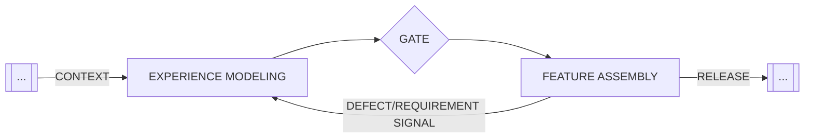

## Definition

**Experience Modeling** is the creation of a queryable **Experience Schema**—a rigid Design System that serves as the source of truth for all frontend generation.

Just as we model data schemas (SQL/Prisma) to constrain backend agents, Experience Modeling restricts frontend agents to a validated set of UI components, tokens, and layouts. It treats the Design System not as a library of suggestions, but as a strict contract.

## The Problem: Design Drift

Without a formal Experience Model, agents suffer from **Design Drift**—the gradual divergence of a product's UI from its intended design specifications.

This occurs because LLMs are probabilistic "vibe engines." When asked to "make a blue button," an agent might:
- Generate raw CSS (`background-color: #007bff`) instead of using tokens (`var(--color-primary)`)
- Hallucinate new component variants that don't exist
- Inconsistently apply spacing and typography

Over hundreds of commits, these micro-inconsistencies accumulate into a codebase that is technically functional but visually chaotic and impossible to maintain.

## The Solution: The Experience Schema

The solution is to formalize the UI as an **Experience Schema**—a strict, machine-readable definition of valid UI states.

Instead of asking the agent to "design a page," we force it to "assemble a page using only these approved blocks." This shifts the agent's role from **Artist** (creating new styles) to **Builder** (assembling pre-built parts).

## Anatomy

### 1. The Component Catalog (The Vocabulary)
The "words" the agent is allowed to use. This is a set of dumb, stateless UI components (Buttons, Inputs, Cards) that strictly enforce brand styles. These components must be:
- **Self-Contained**: Encapsulate all styling logic.
- **Typed**: Export clear TypeScript interfaces.
- **Documented**: exposed via `llms.txt` or similar context files.

### 2. The Context Gate (The Enforcer)
A mechanical barrier between Experience Modeling and [Feature Assembly](/practices/feature-assembly).

<figure class="mermaid-diagram">
  
  <figcaption>Context Gating for Design System Integrity</figcaption>
</figure>

The gate verifies:
1.  **Token Strictness**: No raw CSS values (hex codes, magic numbers).
2.  **Schema Parity**: Documentation matches code.
3.  **Build Success**: The Design System builds in isolation.

### 3. Read-Only Enforcement (The Governance)
During Feature Assembly, the Experience Model must be **Read-Only**. Agents cannot modify the definition of a "Button" to make a feature work; they must use the Button as it exists or request a change to the model.

**Pattern A: Hard Isolation (Enterprise)**
The Design System is a separate package (NPM/NuGet) installed as a dependency. The agent literally cannot modify source files because they are in `node_modules`.

**Pattern B: Toolchain Enforcement (Startups)**
The Design System lives in the same repo, but `pre-commit` hooks or `CODEOWNERS` files prevent the agent from modifying `src/design-system/**` without explicit human override.

## Relationship to Other Patterns

**[Context Gates](/patterns/context-gates)** — Experience Modeling implements a specific type of Context Gate: the "Design Integrity Gate."

**[Feature Assembly](/practices/feature-assembly)** — The phase that *consumes* the Experience Model. Feature Agents assume the Experience Model is immutable context.

**[Agent Personas](/practices/agent-personas)** — We often use a specific "Systems Architect" or "Designer" persona for the Experience Modeling phase, distinct from the "Feature Developer" persona.
