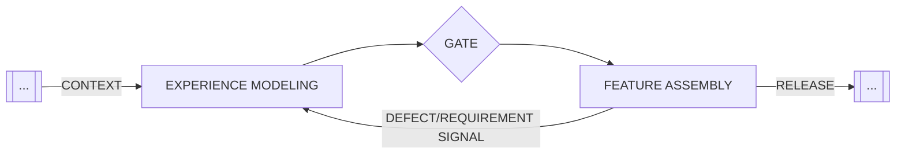

## Definition

Experience Modeling is a foundational phase of the Agentic Software Development Life Cycle (ASDLC). During this phase, we do not focus on building features; instead, we create the Experience Model—an organized design system that agents must follow. Just as we model data schemas for the backend, we also need to model the Experience Schema for the frontend. The Design System serves as the queryable model that the LLM uses to orchestrate the user interface.

## Context Gates

An explicit context gate is implemented between the Experience Modeling and Feature Assembly phases. This methodology will significantly reduce Design Drift, which is the gradual divergence of a product's actual codebase from its intended design specifications caused by the accumulation of micro-inconsistencies generated by AI.

<figure class="mermaid-diagram">
  
  <figcaption>Context Gating for Design System Integrity</figcaption>
</figure>

### Quality
The quality gate is considered satisfied only when the Design System successfully compiles into a standalone, testable artifact. This artifact can vary from a complete enterprise Storybook to a single `.astro` or `.html` reference sheet, as long as it is generated through a custom build process rather than being maintained manually.

**An Experience Modeling –to– Feature Assembly quality gate might verify the following:**

1. **Token Strictness**: The build pipeline fails if any "raw" values (such as hex codes or magic numbers) are detected by the linter, thereby enforcing the semantic token architecture.
2. **Schema Parity**: The automated documentation (llms.txt) must strictly match the exported component type signatures.
3. **Build Success**: The visual artifact must build in isolation. If the reference sheet or catalog cannot be generated, the Experience Model is deemed broken and unfit for agent consumption.

### Acceptance

**Type:** Human-in-the-Loop

Verification is conducted on a live, interactive artifact, ensuring that components are not just static images but functional units. The 'System Architect' or 'Design Technologist' validates the Behavioral Contract of the system. 

The reviewer confirms that experience elements function as expected: buttons manage interaction states (hover, focus, disabled), inputs correctly handle data entry, and layout containers adapt to spatial constraints.

## Recommendations

To ensure consistent results, the Experience Model should be set to Read-Only during the Feature Assembly phase. Feature Agents utilize the design system without making any modifications. While building a feature, it is strictly prohibited for an agent to alter the core component definitions to accommodate a specific use case.

We recommend implementing the "Read-Only" state using one of two patterns, depending on the size of your project.

### Pattern A: Hard Isolation
**Context:** Large Teams, Enterprise, or Production Systems.

In this approach, the Design System is treated like a third-party library, similar to React or Tailwind. It resides in a separate repository and is built and published to a package registry (such as NPM or NuGet). 

Why This Works: The Feature Agent cannot alter the component source code because that code is not present in the project it is working on. It only interacts with the compiled exports.

| Ecosystem | Artifact | Registry | Feature Agent PoV |
|-----------|----------|----------|--------------------|
| TypeScript (Web) | NPM Package (Compiled) | NPM / GitHub Packages | `import { Button } from '@org/design-system';` |
| Python (Data/AI) | Wheel (.whl) (Compiled Lib) | Private PyPI / Artifactory | `from org_core.schemas import UserIntent |
| Unity (Games) | UPM Package | Unity Scoped Registry | `using Org.Mechanics.Input;` |

### Pattern B: Toolchain Enforcement

**Context: Monorepos, Rapid Iteration, or Single-Team Projects**

In this approach, the Design System coexists within the same repository as the application code but is safeguarded by mechanical write barriers. We do not rely on the Agent’s willingness to follow instructions (for example, the prompts found in the `agents.md). Instead, we use the version control system and build pipeline to automatically reject unauthorized modifications.

Why This Works: The method shifts the enforcement from Prompt Space (probabilistic) to Commit Space (deterministic). If a Feature Agent attempts to modify the design system files while building a feature, the pre-commit hooks or CI pipeline will trigger a hard failure, preventing the code from entering the history.

> ### A Layered Defense?
>
> While mechanical barriers provide a hard guarantee, we enhance efficiency by combining them with Agent Constitution (e.g., .cursorrules, agents.md). 
> 
> **The Gate Mechanism (Toolchain):** This prevents corruption in case the Agent makes a mistake.
> 
> **The Agent Constitution (Context):** This helps prevent the Agent from making mistakes in the first place.
>
> This combination reduces waste cycles generating code that will ultimately be rejected by the compiler or linter. 
> However, it is important to note that the context rules are never the sole line of defense.

| Ecosystem | Enforcement Mechanism | Implementation Pattern |
|-----------|-----------------------|------------------------|
| TypeScript (Web) | Husky / Lint-Staged | A pre-commit hook scans staged files. If src/design-system/** is modified |
| Python (Data/AI) | Pre-Commit Framework | A local hook (.pre-commit-config.yaml) validates that src/core/ remains read-only for standard feature branches. |
| Unity (Games) | Asset Post-Processors | An OnPreprocessAsset script in the Editor instantly reverts changes to the /_Core folder if the Editor is not in "Architect Mode". |
