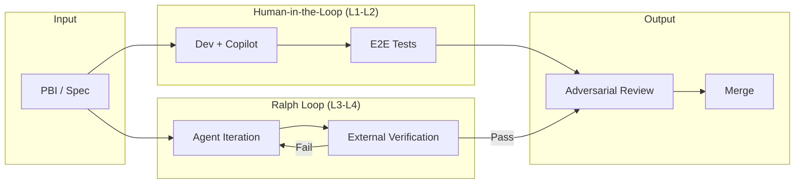

## Definition

The **Ralph Loop**—named by Geoffrey Huntley after the persistently confused but undeterred Simpsons character Ralph Wiggum—is a persistence pattern that turns AI coding agents into autonomous, self-correcting workers.

The pattern operationalizes the [OODA Loop](/concepts/ooda-loop) for terminal-based agents and automates the [Learning Loop](/concepts/learning-loop) with machine-verifiable completion criteria. It enables sustained [L3-L4 autonomy](/concepts/levels-of-autonomy)—"AFK coding" where the developer initiates and returns to find committed changes.



<figure class="mermaid-diagram">
  
  
</figure>

Both lanes start from the same well-structured PBI/Spec and converge at Adversarial Review. The Ralph Loop lane operates autonomously, with human oversight at review boundaries rather than every iteration.

> [!WARNING]
> **The "100 Million Lines" Anti-Pattern**
> 
> Ralph Loop enables persistence, not quality. Using Ralph Loop for unbounded code generation without specs produces what Dan Cripe calls "100 million lines of crappy code"—technically functional but architecturally incoherent and unmaintainable.
> 
> Ralph Loop is a *persistence mechanism*, not a *development methodology*. It must be bounded by:
> - **Exit criteria** defined in [The Spec](/patterns/the-spec)
> - **Verification gates** that check architectural coherence, not just compilation
> - **Scope limits** that prevent unbounded iteration

## The Problem: Human-in-the-Loop Bottleneck

Traditional AI-assisted development creates a productivity ceiling: the human reviews every output before proceeding. This makes the human the slow component in an otherwise high-speed system.

The naive solution—trusting the agent's self-assessment—fails because LLMs confidently approve their own broken code. Research demonstrates that self-correction is only reliable with objective external feedback. Without it, the agent becomes a "mimicry engine" that hallucinates success.

| Aspect | Traditional AI Interaction | Failure Mode |
|--------|---------------------------|--------------|
| **Execution Model** | Single-pass (one-shot) | Limited by human availability |
| **Failure Response** | Process termination or manual re-prompt | Blocks on human attention |
| **Verification** | Human review of every output | Human becomes bottleneck |

## The Solution: External Verification Loop

The Ralph Loop inverts the quality control model: instead of treating LLM failures as terminal states requiring human intervention, it engineers failure as diagnostic data. The agent iterates until external verification (not self-assessment) confirms success.

**Core insight:** Define the "finish line" through machine-verifiable tests, then let the agent iterate toward that finish line autonomously. **Iteration beats perfection.**

| Aspect | Traditional AI | Ralph Loop |
|--------|---------------|------------|
| **Execution Model** | Single-pass | Continuous multi-cycle |
| **Failure Response** | Manual re-prompt | Automatic feedback injection |
| **Persistence Layer** | Context window | File system + Git history |
| **Verification** | Human review | External tooling (Docker, Jest, tsc) |
| **Objective** | Immediate correctness | Eventual convergence |

## Anatomy

### 1. Stop Hooks and Exit Interception

The agent attempts to exit when it believes it's done. A Stop hook intercepts the exit and evaluates current state against success criteria. If the agent hasn't produced a specific "completion promise" (e.g., `<promise>DONE</promise>`), the hook blocks exit and re-injects the original prompt.

This creates a self-referential loop: the agent confronts its previous work, analyzes why the task remains incomplete, and attempts a new approach.

### 2. External Verification (Generator/Judge Separation)

The agent is not considered finished when it *believes* it's done—only when external verification confirms success:

| Evaluation Type | Agent Logic | External Tooling |
|-----------------|-------------|------------------|
| Self-Assessment | "I believe this is correct" | None (Subjective) |
| External Verification | "I will run docker build" | Docker Engine (Objective) |
| Exit Decision | LLM decides to stop | System stops because tests pass |

This is the architectural enforcement of Generator/Judge separation from [Adversarial Code Review](/patterns/adversarial-code-review), but mechanized.

### 3. Git as Persistent Memory

Context windows rot, but Git history persists. Each iteration commits changes, so subsequent iterations "see" modifications from previous attempts. The codebase becomes the source of truth, not the conversation.

Git also enables easy rollback if an iteration degrades quality.

### 4. Context Rotation and Progress Files

**Context rot:** Accumulation of error logs and irrelevant history degrades LLM reasoning.

**Solution:** At 60-80% context capacity, trigger forced rotation to fresh context. Essential state carries over via structured progress files:

- Summary of tasks completed
- Failed approaches (to avoid repeating)
- Architectural decisions to maintain
- Files intentionally modified

This is the functional equivalent of `free()` for LLM memory—applied [Context Engineering](/concepts/context-engineering).

### 5. Convergence Through Iteration

The probability of successful completion P(C) is a function of iterations n:

```
P(C) = 1 - (1 - p_success)^n
```

As n increases (often up to 50 iterations), probability of handling complex bugs approaches 1.

## OODA Loop Mapping

The Ralph Loop is [OODA](/concepts/ooda-loop) mechanized:

| OODA Phase | Ralph Loop Implementation |
|------------|--------------------------|
| **Observe** | Read codebase state, error logs, failed builds |
| **Orient** | Marshal context, interpret errors, read progress file |
| **Decide** | Formulate specific plan for next iteration |
| **Act** | Modify files, run tests, commit changes |

The cycle repeats until external verification passes.

## Relationship to Other Patterns

**[Context Gates](/patterns/context-gates)** — Context rotation + progress files = state filtering between iterations. Ralph Loops are Context Gates applied to the iteration boundary.

**[Adversarial Code Review](/patterns/adversarial-code-review)** — Ralph architecturally enforces Generator/Judge separation. External tooling is the "Judge" that prevents self-assessment failure.

**[The Spec](/patterns/the-spec)** — Completion promises require machine-verifiable success criteria. Well-structured Specs with Gherkin scenarios are ideal Ralph inputs.

**[Workflow as Code](/practices/workflow-as-code)** — The practice for implementing Ralph Loops using typed step abstractions rather than prompt-based orchestration. Provides deterministic control flow with the agent invoked only for probabilistic tasks.

## Anti-Patterns

| Anti-Pattern | Description | Failure Mode |
|--------------|-------------|--------------|
| **Vague Prompts** | "Improve this codebase" without specific criteria | Divergence; endless superficial changes |
| **No External Verification** | Relying on agent self-assessment | Self-Assessment Trap; hallucinates success |
| **No Iteration Caps** | Running without max iterations limit | Infinite loops; runaway API costs |
| **No Sandbox Isolation** | Agent has access to sensitive host files | Security breach; SSH keys, cookies exposed |
| **No Context Rotation** | Letting context window fill without rotation | Context rot; degraded reasoning |
| **No Progress Files** | Fresh iterations re-discover completed work | Wasted tokens; repeated mistakes |

### Unbounded Generation

Running Ralph Loop without scope constraints produces volume without value. Each iteration may "fix" the immediate error while introducing architectural drift. Over time, the codebase becomes:

- **Internally inconsistent**: Different modules make different assumptions
- **Unmaintainable**: No human understands the full system
- **Expensive to verify**: Review time exceeds generation time

### Missing Architectural Verification

Ralph Loop's default exit criteria (tests pass, compilation succeeds) don't verify architectural coherence. A loop that only checks "does it work?" will happily generate code that violates design patterns, duplicates logic, or introduces subtle inconsistencies.

**Mitigation**: Combine Ralph Loop with [Constitutional Review](/patterns/constitutional-review) to verify outputs against architectural principles, not just functional requirements.

## Guardrails

| Risk | Mitigation |
|------|------------|
| Infinite Looping | Hard iteration caps (20-50 iterations) |
| Context Rot | Periodic rotation at 60-80% capacity |
| Security Breach | Sandbox isolation (Docker, WSL) |
| Token Waste | Exact completion promise requirements |
| Logic Drift | Frequent Git commits each iteration |
| Cost Overrun | API cost tracking per session |


