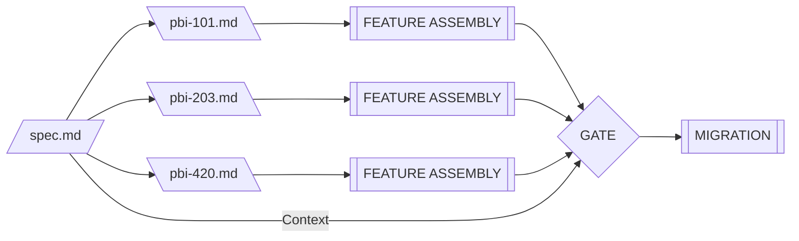

## Definition

In the ASDLC, **The Spec** is the permanent "Source of Truth" for a feature. It defines *how* the system works (Design) and *how* we know it works (Quality).

Unlike a traditional Tech Spec or PRD, which is often "fire and forget," **The Spec** is a *Living Document*. It resides in the repository alongside the code and evolves with every change to the feature.

## The Problem: Context Amnesia

Agents do not have long-term memory of Jira tickets or Slack conversations. They rely on **Context**. When an agent is tasked with modifying or refactoring a feature six months after its initial implementation, it needs immediate access to:

- The architectural decisions that shaped the feature
- The constraints that must not be violated
- The quality criteria that define success

Without **The Spec**, agents are forced to reverse-engineer intent from code comments and commit messages—a process prone to hallucination and architectural drift.

Traditional documentation approaches fail because:

1. **Wikis Decay:** Separate documentation systems fall out of sync with code
2. **Tickets Disappear:** Issue trackers capture deltas (changes), not state (current rules)
3. **Comments Lie:** Code comments describe implementation details, not architectural intent
4. **Memory Fails:** Tribal knowledge evaporates when team members leave

The Spec solves this by making the documentation a **first-class citizen** in the codebase, subject to the same version control and review processes as the code itself.

## The Role: Permanent Context

The Spec provides the "State Definition" that an Agent needs to understand the system's current rules.

### Key Characteristics

- **Location:** Version-controlled alongside code (e.g., `/plans/{feature-name}/spec.md`)
- **Lifespan:** Infinite (until the feature is deprecated)
- **Audience:** Architects and Engineers (Authors), Agents (Consumers)
- **Maintenance:** Updated in the same commit as code changes
- **Scope:** Feature-level rules and contracts

### What Makes It "Living"

A Living Spec is not static—it evolves with the system:

- When an API contract changes, the spec is updated in the same PR
- When quality targets shift, the spec reflects the new thresholds
- When anti-patterns are discovered, they're documented for future reference
- When features are deprecated, the spec is marked accordingly (not deleted)

This synchronization transforms the spec from "documentation" into **executable context** for agent-driven development.

## Anatomy of a Spec

Every spec consists of two complementary parts:

### Part A: The Blueprint (Design)

The Blueprint defines **implementation constraints** that prevent agents from hallucinating architectures that violate system patterns.

**Purpose:** Answer the question "How is this feature designed?"

**Core Elements:**

1. **Context:** Why does this feature exist? (Business Intent)
2. **Architecture:** Explicit definition of API contracts, database schemas, dependency directions, and data flow
3. **Anti-Patterns:** "Negative Constraints" telling agents what *not* to do

**Example Structure:**

```/dev/null/blueprint-structure.md#L1-11
## Blueprint

### Context
The user notification system delivers real-time alerts for critical events 
without requiring page refresh.

### Architecture
- Transport: WebSocket connection
- State Management: Redux with immutable updates
- Persistence: IndexedDB for offline queue
- Schema: Zod validated (see src/types/Notification.ts)
```

The Blueprint section is **prescriptive**—it constrains solution space by defining what is architecturally permissible.

### Part B: The Contract (Quality)

The Contract defines **verification rules** that exist independently of any specific task. This section shifts the "Definition of Done" left, making quality criteria explicit before implementation begins.

**Purpose:** Answer the question "How do we know this feature works correctly?"

**Core Elements:**

1. **Definition of Done:** Observable success criteria (what must be true when complete)
2. **Regression Guardrails:** Critical invariants that must never break (even during refactoring)
3. **Scenarios:** Gherkin-style user journeys that can be converted into E2E tests

**Example Structure:**

```/dev/null/contract-structure.md#L1-13
## Contract

### Definition of Done
- Notification appears in UI within 100ms of WebSocket message
- System survives network interruption (auto-reconnect within 5s)

### Regression Guardrails
- Must handle malformed JSON gracefully (log, don't crash)
- Must not exceed 50MB memory usage for 1000+ notifications

### Scenarios
**Scenario: Critical Alert Display**
- Given: User is logged in with active WebSocket connection
- When: Backend publishes a "payment_failed" event
```

The Contract section is **verifiable**—every statement can be tested or measured.

## Delta vs. State: The Relationship to PBIs

A common anti-pattern is defining quality rules (like "Latency < 200ms") inside a Product Backlog Item (PBI). This creates a fundamental mismatch:

| Dimension | The Spec | The PBI |
|-----------|----------|---------|
| **Purpose** | Define the State (how it works) | Define the Delta (what changes) |
| **Lifespan** | Permanent (lives with the code) | Transient (closed after merge) |
| **Scope** | Feature-level rules | Task-level instructions |
| **Audience** | Architects, Agents (Reference) | Agents, Developers (Execution) |
| **Updates** | Evolves with architecture | Created per sprint, then archived |

### The Problem with Tickets-as-Specs

When quality rules live in tickets:

1. **They die when the ticket closes** → Agent refactoring 6 months later has no context
2. **They're scattered across multiple tickets** → No single source of truth
3. **They're written for human task execution** → Not optimized for agent consumption

### The Solution: Specs as State, PBIs as Deltas

The Spec defines the **current state** of the system:
- "All notifications must deliver within 100ms"
- "API must handle 1000 req/sec"
- "UI must support screen readers"

The PBI defines the **change**:
- "Add SMS fallback to notification system"
- "Optimize database query for search endpoint"
- "Implement dark mode toggle"

The PBI *references* the Spec for context and *updates* the Spec when it changes contracts or quality rules.

### Workflow Example

```/dev/null/workflow-example.md#L1-11
Sprint 1: PBI-101 "Build notification system"
  → Creates /plans/notifications/spec.md with initial contract
  → Spec defines: "Deliver within 100ms via WebSocket"

Sprint 3: PBI-203 "Add SMS fallback"
  → Updates spec.md with new transport rules
  → PBI-203 is closed, but the spec persists with updated state

Sprint 8: PBI-420 "Refactor notification queue"
  → Agent reads spec.md, sees SMS rules still apply
  → Refactoring preserves all documented contracts
```

## File System Standard

Specs are organized by **Feature Domain**, not by Increment ID or sprint number. This ensures that developers (human or AI) can find documentation without needing to know the project's ticket history.

**Standard Structure:**

```/dev/null/file-structure.md#L1-10
/project-root
├── ARCHITECTURE.md              # Global Constitution (system-wide rules)
├── plans/                       # Feature Contexts
│   ├── user-notifications/   
│   │   └── spec.md              # Notification feature spec
│   └── payment-gateway/
│       └── spec.md              # Payment feature spec
└── src/                         # Implementation Code
    └── features/
        ├── notifications/
```

**Key Principles:**

- **Directory Name:** Match the feature's conceptual name (kebab-case)
- **File Name:** Always `spec.md` for consistency
- **Scope:** One spec per independently evolvable feature
- **Granularity:** Split large domains into sub-features rather than creating monolithic specs

## Context Gating: Specs as Quality Checkpoints

In the ASDLC, Specs serve as the "acceptance criteria" verified at Context Gates. Before code is merged, the gate validates:

1. **Blueprint Compliance:** Does the implementation follow the documented architecture?
2. **Contract Fulfillment:** Are all Definition of Done items satisfied?
3. **Anti-Pattern Absence:** Were any forbidden patterns introduced?
4. **Scenario Coverage:** Do E2E tests validate all documented scenarios?

This process transforms the Spec from passive documentation into an **active quality mechanism**.



<figure class="mermaid-diagram">
  
  <figcaption>Context Gating of Feature Assembly using The Spec</figcaption>
</figure>

## Relationship to Other ASDLC Patterns

### Spec-Driven Development
The Spec is the foundational artifact that enables [Spec-Driven Development](/concepts/spec-driven-development). The development philosophy states: "Code must fulfill the Spec," making the Spec the authoritative source rather than an afterthought.

### Context Engineering
The Spec is a structured context asset optimized for agent consumption. By organizing information into predictable sections (Blueprint, Contract), agents can efficiently extract relevant constraints. See [Context Engineering](/concepts/context-engineering) for principles on crafting agent-readable artifacts.

### Context Gates
Specs define the criteria enforced at Context Gates. When code passes through a gate, it is validated against the Spec's Definition of Done and Regression Guardrails.

### Agent Constitution
The global `ARCHITECTURE.md` defines system-wide rules (global constitution), while feature specs define domain-specific rules (local constitution). Agents must load both when working on features.

### The PBI
As discussed above, [The PBI](/patterns/the-pbi) is the transient execution unit (Delta), while The Spec is the permanent reference (State). PBIs point to Specs for context and update Specs when changing contracts.

## Anti-Patterns

### The "Stale Spec" 
**Problem:** The spec is created during planning but never updated as the feature evolves.

**Impact:** Agents operate on outdated assumptions, causing architectural drift and broken contracts.

**Prevention:** Make spec updates mandatory in Definition of Done; include spec review in PR checklists.

### The "Spec in Slack"
**Problem:** Critical design decisions are discussed in ephemeral channels but never committed to the repository.

**Impact:** Context is lost when conversations scroll out of view; new team members have no access to decision history.

**Prevention:** Use the spec as the "record of decision"; after consensus, immediately update `spec.md` with a commit linking to the discussion.

### The "Monolithic Spec"
**Problem:** A single 5000-line spec tries to document the entire application.

**Impact:** Unmaintainable; agents waste context window space loading irrelevant information.

**Prevention:** Split into feature-domain specs; use `ARCHITECTURE.md` only for cross-cutting concerns.

### The "Spec-as-Tutorial"
**Problem:** The spec reads like a beginner's guide, explaining basic programming concepts.

**Impact:** Low signal-to-noise ratio; agents cannot quickly extract constraints.

**Prevention:** Assume engineering competence; document *constraints* and *decisions*, not general knowledge.

### The "Copy-Paste Code"
**Problem:** The spec duplicates large chunks of implementation code.

**Impact:** Duplication creates maintenance burden; specs fall out of sync with code.

**Prevention:** Reference canonical sources (file paths + line numbers); only include minimal examples to illustrate patterns.

## Implementation Guide

For practical instructions on creating, maintaining, and evolving specs, see the [Living Specs Practice Guide](/practices/living-specs).

The practice guide covers:
- When to create or update specs
- File structure and organization
- Detailed anatomy with examples
- Maintenance protocols
- Best practices and tooling
- Common pitfalls and solutions
- Template for new specs

## References

- [Living Specs Practice Guide](/practices/living-specs) - Practical implementation instructions
- [Spec-Driven Development](/concepts/spec-driven-development) - Development philosophy
- [Context Engineering](/concepts/context-engineering) - Optimizing context for agents
- [The PBI](/patterns/the-pbi) - Execution units that reference specs
- [Living Documentation (Martin Fowler)](https://martinfowler.com/bliki/LivingDocumentation.html)