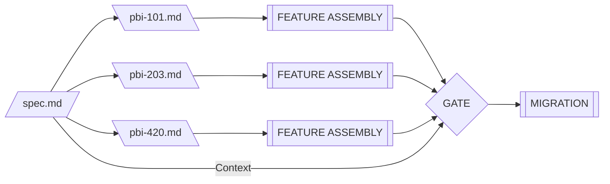

## Definition

In the ASDLC, **The Spec** is the permanent "Source of Truth" for a feature. It defines *how* the system works (Design) and *how* we know it works (Quality).

Unlike a traditional Tech Spec or PRD, which is often "fire and forget," **The Spec** is a *Living Document*. It resides in the repository alongside the code and evolves with every change to the feature.

## The Problem: Context Amnesia

Agents do not have long-term memory of Jira tickets or Slack conversations. They rely on **Context**. When an agent is tasked with modifying or refactoring a feature six months after its initial implementation, it needs immediate access to:

- The architectural decisions that shaped the feature
- The constraints that must not be violated
- The quality criteria that define success

Without **The Spec**, agents are forced to reverse-engineer intent from code comments and commit messages—a process prone to hallucination and architectural drift.

## The Role: Permanent Context

The Spec provides the "State Definition" that an Agent needs to understand the system's current rules.

- **Location:** `/plans/{feature-name}/spec.md`
- **Lifespan:** Infinite (until the feature is deprecated)
- **Audience:** Architects and Engineers (Authors), Agents (Consumers)
- **Version Control:** Committed to the repository, subject to code review

## Anatomy of a Spec

### Part A: The Blueprint (Design)

This section defines the "Implementation Constraints." It prevents the Agent from hallucinating an architecture that violates system patterns.

**Core Elements:**

1. **Context:** Why does this feature exist? (Business Intent)
2. **Architecture:** Explicit definition of API contracts, database schemas, and dependency directions
3. **Anti-Patterns:** "Negative Constraints" telling the Agent what *not* to do

**Example:**

```/dev/null/spec-blueprint-example.md#L1-15
## Blueprint

### Context
The user notification system delivers real-time alerts for critical events 
(payment failures, security warnings) without requiring page refresh.

### Architecture
- **Transport:** WebSocket connection via `/api/ws/notifications`
- **State Management:** Redux slice `notifications` with immutable updates
- **Persistence:** IndexedDB for offline queue (max 100 items)
- **Schema:** See `src/types/Notification.ts` (Zod validated)

### Anti-Patterns
- Do NOT use `localStorage` for notification state (exceeds quota)
- Do NOT poll REST endpoints (defeats real-time intent)
- Do NOT use global event emitters (violates Redux pattern)
```

### Part B: The Contract (Quality)

This section shifts the "Definition of Done" left. It defines verification rules that exist independently of any specific task.

**Core Elements:**

1. **Definition of Done:** Observable success criteria
2. **Regression Guardrails:** Critical invariants that must never break
3. **Scenarios:** Gherkin-style user journeys (Given/When/Then) that can be converted into E2E tests

**Example:**

```/dev/null/spec-contract-example.md#L1-18
## Contract

### Definition of Done
- Notification appears in UI within 100ms of WebSocket message
- Unread count badge updates without full page reload
- System survives network interruption (auto-reconnect within 5s)

### Regression Guardrails
- Must handle malformed JSON gracefully (log, don't crash)
- Must not exceed 50MB memory usage for 1000+ notifications
- Must support screen readers (WCAG 2.1 AA)

### Scenarios
**Scenario: Critical Alert Display**
- Given: User is logged in with active WebSocket connection
- When: Backend publishes a "payment_failed" event
- Then: Red toast notification appears in top-right within 100ms
- And: Notification persists until user dismisses or 10s timeout
```

## File System Standard

Specs are organized by **Feature Domain**, not by Increment ID. This ensures that new developers (human or AI) can find the documentation for a feature without needing to know the PBI history.

```/dev/null/file-structure.txt#L1-10
/project-root
├── ARCHITECTURE.md           # Global Constitution (Protected)
├── plans/                    # Feature Contexts
│   └── user-notifications/   
│       └── spec.md           # The Unified Spec
│   └── payment-gateway/
│       └── spec.md
└── src/                      # The Code
    └── features/
        └── notifications/
```

## Delta vs. State: Why Separate from PBIs?

A common anti-pattern is defining quality rules (like "Latency < 200ms") inside a Product Backlog Item (PBI).

**The Problem:**

1. **Ticket = Delta:** A PBI describes a *change* ("Add SMS fallback to notifications")
2. **Spec = State:** A spec describes the *current rule* ("All notifications must deliver within 100ms")

If the rule lives in the ticket, it dies when the ticket is closed. By forcing the rule into `spec.md`, we ensure that an Agent refactoring the code 6 months later still sees the latency constraint.

**Example process**



<figure class="mermaid-diagram">
  
  <figcaption>Context Gating of Feature Assembly using The Spec</figcaption>
</figure>

_

```/dev/null/timeline-example.md#L1-8
Sprint 1: PBI-101 "Build notification system"
  → Creates `/plans/notifications/spec.md` with initial contract

Sprint 3: PBI-203 "Add SMS fallback"
  → Updates spec.md with new transport rules
  → PBI-203 is closed, but the spec persists

Sprint 8: PBI-420 "Refactor notification queue"
  → Agent reads spec.md, sees SMS rules still apply
```

## Implementation Guidelines

### When to Create a Spec

Create a new spec when:

- Starting a new feature domain (not a trivial bug fix)
- Introducing architectural patterns that other features will depend on
- Building user-facing workflows with defined acceptance criteria

### When to Update a Spec

Update an existing spec when:

- Changing API contracts or data schemas
- Adding new quality constraints (e.g., performance targets)
- Discovering anti-patterns during code review
- Removing deprecated functionality

### Maintenance Protocol

1. **Treat as Code:** Specs must pass through the same review process as source code
2. **Keep in Sync:** If the code changes the behavior, the spec MUST be updated in the same commit
3. **Deprecation Over Deletion:** Mark outdated sections as `[DEPRECATED]` rather than removing history
4. **Link Bidirectionally:** Code comments should reference the spec (`// See: /plans/notifications/spec.md#contract`)

## Relationship to Other ASDLC Patterns

- **Spec-Driven Development:** The Spec is the artifact that enables spec-driven workflows
- **Context Engineering:** The Spec is a structured context asset optimized for agent consumption
- **Context Gates:** Specs serve as the "acceptance criteria" verified at quality gates
- **Agent Constitution:** The global `ARCHITECTURE.md` defines system-wide rules; feature specs define local rules

## Anti-Patterns

### The "Stale Spec"

**Problem:** The spec is created during planning but never updated as the feature evolves.

**Solution:** Make spec updates a mandatory part of the Definition of Done for every PBI that touches the feature.

### The "Spec in Slack"

**Problem:** Critical design decisions are discussed in Slack or Jira comments but never committed to the repository.

**Solution:** Use the spec as the "record of decision." After consensus, immediately update `spec.md` with a commit message linking to the discussion thread.

### The "Monolithic Spec"

**Problem:** A single 5000-line spec tries to document the entire application.

**Solution:** Split into feature-domain specs. Each feature gets its own `/plans/{feature}/spec.md`.

### The "Spec-as-Tutorial"

**Problem:** The spec reads like a walkthrough for junior developers, filled with basic programming concepts.

**Solution:** The spec assumes engineering competence. It documents *constraints* and *decisions*, not general knowledge.

## Best Practices

1. **Start with Anti-Patterns:** Tell agents what NOT to do before telling them what TO do
2. **Use Concrete Examples:** Show sample API payloads, database schemas, and code snippets
3. **Reference, Don't Duplicate:** Link to external type definitions rather than copying them
4. **Version Milestones:** Add a changelog section to track major architectural shifts
5. **Test Scenarios First:** Write the Gherkin scenarios before implementation to clarify intent

## Template

```/dev/null/spec-template.md#L1-30
# Feature: [Feature Name]

## Blueprint

### Context
[Why does this feature exist? What business problem does it solve?]

### Architecture
- **API Contracts:** [Endpoints, methods, payloads]
- **Data Models:** [Schemas, relationships, constraints]
- **Dependencies:** [What other features/services does this depend on?]

### Anti-Patterns
- [What must agents avoid when working on this feature?]

## Contract

### Definition of Done
- [ ] [Observable success criterion 1]
- [ ] [Observable success criterion 2]

### Regression Guardrails
- [Critical invariant that must never break]

### Scenarios
**Scenario: [Name]**
- Given: [Precondition]
- When: [Action]
- Then: [Expected outcome]
```

## References

- [Spec-Driven Development](/concepts/spec-driven-development)
- [Context Engineering](/concepts/context-engineering)
- [Living Documentation (Martin Fowler)](https://martinfowler.com/bliki/LivingDocumentation.html)
