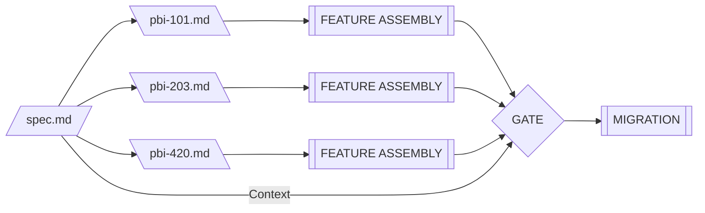

## Definition

A **Spec** is the permanent source of truth for a feature. It defines *how* the system works (Design) and *how* we know it works (Quality).

Unlike traditional tech specs or PRDs that are "fire and forget," specs are **living documents**. They reside in the repository alongside the code and evolve with every change to the feature.

## The Problem: Context Amnesia

Agents do not have long-term memory. They cannot recall Jira tickets from six months ago or Slack conversations about architectural decisions. When an agent is tasked with modifying a feature, it needs immediate access to:

- The architectural decisions that shaped the feature
- The constraints that must not be violated
- The quality criteria that define success

Without specs, agents reverse-engineer intent from code comments and commit messages—a process prone to hallucination and architectural drift.

Traditional documentation fails because:
- **Wikis decay** — separate systems fall out of sync with code
- **Tickets disappear** — issue trackers capture deltas (changes), not state (current rules)
- **Comments lie** — code comments describe implementation, not architectural intent
- **Memory fails** — tribal knowledge evaporates when team members leave

Specs solve this by making documentation a **first-class citizen** in the codebase, subject to the same version control and review processes as the code itself.

## State vs Delta

This is the core distinction that makes agentic development work at scale.

| Dimension | The Spec | The PBI |
|-----------|----------|---------|
| **Purpose** | Define the State (how it works) | Define the Delta (what changes) |
| **Lifespan** | Permanent (lives with the code) | Transient (closed after merge) |
| **Scope** | Feature-level rules | Task-level instructions |
| **Audience** | Architects, Agents (Reference) | Agents, Developers (Execution) |

The Spec defines the **current state** of the system:
- "All notifications must deliver within 100ms"
- "API must handle 1000 req/sec"

The PBI defines the **change**:
- "Add SMS fallback to notification system"
- "Optimize database query for search endpoint"

The PBI *references* the Spec for context and *updates* the Spec when it changes contracts.

### Why Separation Matters

```
Sprint 1: PBI-101 "Build notification system"
  → Creates /plans/notifications/spec.md
  → Spec defines: "Deliver within 100ms via WebSocket"

Sprint 3: PBI-203 "Add SMS fallback"
  → Updates spec.md with new transport rules
  → PBI-203 is closed, but the spec persists

Sprint 8: PBI-420 "Refactor notification queue"
  → Agent reads spec.md, sees all rules still apply
  → Refactoring preserves all documented contracts
```

Without this separation, the agent in Sprint 8 has no visibility into decisions made in Sprint 1.

## The Assembly Model

Specs serve as the context source for Feature Assembly. Multiple PBIs reference the same spec, and the spec's contracts are verified at quality gates.



<figure class="mermaid-diagram">
  
  
</figure>

## Anatomy

Every spec consists of two parts:

### Blueprint (Design)
Defines **implementation constraints** that prevent agents from hallucinating invalid architectures.

- **Context** — Why does this feature exist?
- **Architecture** — API contracts, schemas, dependency directions
- **Anti-Patterns** — What agents must NOT do

### Contract (Quality)
Defines **verification rules** that exist independently of any specific task.

- **Definition of Done** — Observable success criteria
- **Regression Guardrails** — Invariants that must never break
- **Scenarios** — [Gherkin](/concepts/gherkin)-style behavioral specifications

The Contract section implements [Behavior-Driven Development](/concepts/behavior-driven-development) principles: scenarios define *what* behavior is expected without dictating *how* to implement it. This allows agents to interpret intent dynamically while providing clear verification criteria.

For detailed structure, examples, and templates, see the [Living Specs Practice Guide](/practices/living-specs).

## Relationship to Other Patterns

**[The PBI](/patterns/the-pbi)** — PBIs are the transient execution units (Delta) that reference specs for context. When a PBI changes contracts, it updates the spec in the same commit.

**[Feature Assembly](/practices/feature-assembly)** — Specs define the acceptance criteria verified during assembly. The diagram above shows this flow.

**[Experience Modeling](/patterns/experience-modeling)** — Experience models capture user journeys; specs capture the technical contracts that implement those journeys.

**[Context Engineering](/concepts/context-engineering)** — Specs are structured context assets optimized for agent consumption, with predictable sections (Blueprint, Contract) for efficient extraction.

**[Behavior-Driven Development](/concepts/behavior-driven-development)** — BDD provides the methodology for the Contract section. [Gherkin](/concepts/gherkin) scenarios serve as "specifications of behavior" that guide agent reasoning and define acceptance criteria.

## Iterative Spec Refinement

Kent Beck critiques spec-driven approaches that assume "you aren't going to learn anything during implementation." This is valid—specs are not waterfall artifacts.

**The refinement cycle:**

1. **Initial Spec** — Capture known constraints (API contracts, quality targets, anti-patterns)
2. **Implementation Discovery** — Agent or human encounters edge cases, performance issues, or missing requirements
3. **Spec Update** — New constraints committed alongside the code that revealed them
4. **Verification** — Gate validates implementation against updated spec
5. **Repeat**

This is the [Learning Loop](/concepts/learning-loop) applied to specs: the spec doesn't prevent learning—it captures learnings so agents can act on them in future sessions.

> "Large Language Models give us great leverage—but they only work if we focus on learning and understanding."
> — Unmesh Joshi, via Martin Fowler


## Industry Validation

The Spec pattern has emerged independently across the industry under different names. Notably, Rasmus Widing's **Product Requirement Prompt (PRP)** methodology defines the same structure: Goal + Why + Success Criteria + Context + Implementation Blueprint + Validation Loop.

His core principles—"Plan before you prompt," "Context is everything," "Scope to what the model can reliably do"—mirror ASDLC's Spec-Driven Development philosophy.

See [Product Requirement Prompts](/concepts/product-requirement-prompt) for the full mapping and [Industry Alignment](/resources/industry-alignment) for convergent frameworks.

See also:
- [Living Specs Practice Guide](/practices/living-specs) — Implementation instructions, templates, and best practices
- [Behavior-Driven Development](/concepts/behavior-driven-development) — The methodology behind Contract scenarios
- [Gherkin](/concepts/gherkin) — Syntax guidance for writing behavioral specifications


