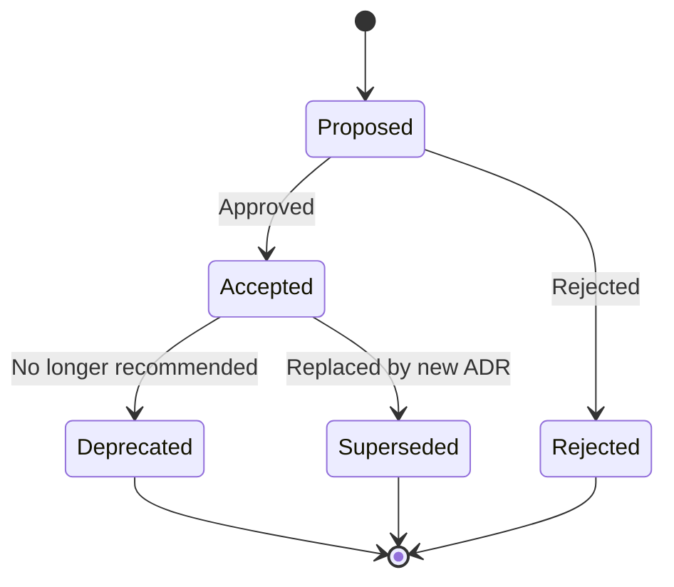

## Definition

**ADR Authoring** is the practice of writing, organizing, and maintaining Architecture Decision Records throughout a project's lifecycle. This practice implements [The ADR](/patterns/the-adr) pattern with concrete templates, file organization conventions, and lifecycle management.

Following this practice produces a searchable, version-controlled archive of architectural decisions that serves both humans and agents.

## When to Use

**Write an ADR when:**

- Making a technology choice (database, framework, language)
- Choosing between architectural approaches (monolith vs microservices, REST vs GraphQL)
- Accepting a significant trade-off (performance vs simplicity, vendor lock-in vs flexibility)
- Establishing a constraint that will affect future work ("all APIs must be versioned")
- Reverting or superseding a previous decision

**Skip an ADR when:**

- The decision is easily reversible (naming convention for a single file)
- The decision is already documented in a feature spec
- No reasonable alternatives exist (using HTTP for web requests)
- The decision is entirely tactical, not architectural

## Process

### Step 1: Check for Existing ADRs

Before writing a new ADR, search for existing decisions in the same domain.

```bash
# Search for related ADRs
grep -r "database" docs/adrs/
```

If a relevant ADR exists, you may need to **supersede** it rather than create a fresh decision.

### Step 2: Choose an ID and Title

Assign the next sequential ID and write a clear, descriptive title.

**Format:** `ADR-NNN-short-descriptive-title.md`

**Filename conventions:**
- Use lowercase with hyphens
- Keep it scannable (3-7 words after the ID)
- Start with the domain if helpful: `ADR-015-auth-use-supabase.md`

### Step 3: Document the Context

This is the most important section. Capture the forces that make this decision necessary:

- What triggered this decision?
- What constraints exist?
- What are the non-negotiable requirements?
- What is the timeline pressure?

> [!TIP]
> Write context as if explaining to someone joining the team next month. They should understand *why* this decision was needed, not just what was chosen.

### Step 4: State the Decision

Write a clear, unambiguous statement of what was decided.

**Good:** "We will use PostgreSQL as the primary database for all transactional data."

**Bad:** "We decided to maybe consider PostgreSQL or something similar."

### Step 5: Document Consequences

List outcomes honestly—positive, negative, and neutral.

**Positive:** What capabilities or benefits does this enable?

**Negative:** What trade-offs are we accepting? What doors does this close?

**Neutral:** What changes but isn't inherently good or bad?

> [!WARNING]
> ADRs with no negative consequences are suspicious. Every significant decision has trade-offs. Hiding them leads to confusion when the downsides surface later.

### Step 6: Record Alternatives Considered

For each seriously considered alternative, explain why it was rejected. Use specific, concrete reasons—not vague dismissals.

**Good:** "Firebase Realtime Database rejected—would require a second database system and doesn't integrate with existing PostgreSQL data models."

**Bad:** "Firebase rejected—too complex."

### Step 7: Set Status and Commit

Set status to `Proposed` for review, or `Accepted` if the decision is final. Commit the ADR alongside related code changes when possible.

```bash
git add docs/adrs/ADR-015-auth-use-supabase.md
git commit -m "docs: add ADR-015 for Supabase Auth decision"
```

## Template

```markdown
# ADR-NNN: {Title}

**Status:** Proposed | Accepted | Deprecated | Superseded by ADR-XXX

**Date:** YYYY-MM-DD

## Context

{What forces are at play? What problem needs solving? What constraints exist?}

## Decision

{What was decided? State clearly and unambiguously.}

## Consequences

**Positive:**
- {Benefit 1}
- {Benefit 2}

**Negative:**
- {Trade-off 1}
- {Trade-off 2}

**Neutral:**
- {Change 1}

## Alternatives Considered

### {Alternative 1}

{Description and rejection rationale}

### {Alternative 2}

{Description and rejection rationale}
```

## File Organization

Recommended directory structure:

```
docs/
└── adrs/
    ├── README.md              # Index and search tips
    ├── ADR-001-use-postgres.md
    ├── ADR-002-event-driven.md
    ├── ADR-003-supabase-auth.md
    └── ...
```

The `README.md` should include:
- Quick reference of active ADRs
- Instructions for creating new ADRs
- Search tips (grep patterns for common queries)

## Lifecycle Management

### Status Transitions



### Superseding an ADR

When a decision is replaced:

1. Create the new ADR with the updated decision
2. Update the old ADR's status: `**Status:** Superseded by [ADR-NNN](./ADR-NNN-title.md)`
3. Do **not** delete or modify the content of the superseded ADR

This preserves the archaeological record of how thinking evolved.

## Common Mistakes

### The Novel

**Problem:** ADR is 10+ pages, covering multiple decisions.

**Solution:** Split into multiple ADRs. Each ADR should decide exactly one thing.

### The Hidden Trade-off

**Problem:** Consequences section lists only positives.

**Solution:** Force yourself to list at least one negative consequence. If you can't find any, you haven't thought hard enough.

### The Vague Alternative

**Problem:** Alternatives listed but rejection rationale is "too complex" or "not a good fit."

**Solution:** Be specific. What exactly made it complex? What would adopting it have required?

### The Orphaned Decision

**Problem:** ADR created but never reviewed or status remains "Proposed" indefinitely.

**Solution:** Include ADR review in your PR/code review process. ADRs should move to "Accepted" or "Rejected" within one sprint.

### The Missing Context

**Problem:** Decision makes no sense without knowing the constraints that existed at the time.

**Solution:** Write context as if for a new team member. Include timeline, budget, team skills, existing systems.

## Agentic Integration

ADRs serve as high-value context for agents:

**Include in agent context** when:
- Working on code in the ADR's domain
- Making decisions that might conflict with existing ADRs
- Refactoring systems covered by architectural decisions

**Agent-friendly practices:**
- Keep ADRs in a consistent location (`docs/adrs/`)
- Use clear, searchable titles
- Tag ADRs with domain keywords in a frontmatter section (optional)

An agent working on authentication should be provided `ADR-003-supabase-auth.md` as context to avoid accidentally violating the architectural constraints.

## Related Patterns

This practice implements:

- **[The ADR](/patterns/the-adr)** — The structural pattern this practice executes

See also:

- **[Living Specs](/practices/living-specs)** — For feature documentation that evolves (unlike immutable ADRs)
- **[Request for Comments](/concepts/request-for-comments)** — For proposals that spawn multiple ADRs
- **[Context Engineering](/concepts/context-engineering)** — ADRs as context sources for agents
