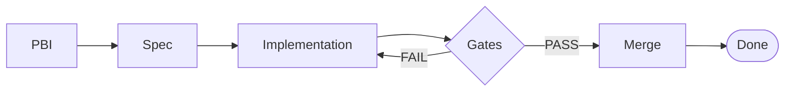

## Definition

**Feature Assembly** is the implementation phase in the Agentic SDLC where [PBIs](/patterns/the-pbi) (Product Backlog Items) are executed by agents or developers using [The Spec](/patterns/the-spec) as the authoritative source of truth. Unlike traditional development where implementation details drift from requirements, Feature Assembly enforces strict contract validation through [Context Gates](/patterns/context-gates) before code enters the codebase.

This is where the "Delta" (PBI) meets the "State" (Spec), and the output is verified code that provably satisfies documented contracts.

## The Assembly Pipeline



<figure class="mermaid-diagram">
  
  
</figure>

## The Problem: Implementation Drift

Traditional development workflows suffer from a disconnect between specification and implementation:

**Spec-less Coding** — Developers implement features based on vague tickets, Slack discussions, or tribal knowledge, leading to inconsistent interpretations.

**Post-Hoc Documentation** — Documentation is written after implementation (if at all), capturing what was built rather than what was intended.

**Silent Contract Violations** — Code that "works" but violates architectural constraints, performance requirements, or edge case handling goes undetected until production.

**Agent Hallucination** — LLM-generated code drifts toward "average solutions" found in training data, ignoring project-specific constraints.

## The Solution: Spec-Driven Assembly

Feature Assembly inverts the traditional workflow:

1. **The Spec is written first** — [Specs](/patterns/the-spec) define contracts before any code is written
2. **PBIs reference the Spec** — [PBIs](/patterns/the-pbi) point to spec sections rather than duplicating requirements
3. **Implementation is validated against contracts** — Code must pass quality gates that verify spec compliance
4. **Gates block invalid code** — Failed validation prevents merge, forcing correction

This creates a closed loop where the Spec is both the input (what to build) and the acceptance criteria (how to verify).

## The Assembly Workflow

### Phase 1: Context Loading

The agent or developer begins by loading the necessary context:

**Input:**
- The PBI (defines the delta/change)
- The Spec (defines the contracts)
- The codebase (current state)

**Example:**
```bash
# PBI-427: Implement notification preferences API
# Context:
#   - Spec: /plans/notifications/spec.md
#   - Scope: src/api/notifications/
```

### Phase 1a: Plan Verification

Before implementation begins, verify the agent's proposed execution plan.

Modern coding agents generate an internal execution plan before writing code. This plan must be reviewed—blind approval is a common failure mode.

**The Vibe Check:**
- Does the agent's plan explicitly reference the Spec?
- A plan that says "I will implement the feature" without citing spec sections is a red flag

**The Logic Check:**
- Does the agent propose to change **State** (the Spec) or just **Delta** (the Code)?
- Implementation should only modify code, not silently redefine requirements

**The Observability First Rule:**
- Before implementing complex logic, ensure the plan includes adding logs or traces
- The agent should "instrument itself" to prove the code path is reachable before attempting to fix business logic

> [!IMPORTANT]
> If the plan is vague ("I will fix the bug"), reject it. Demand a specific file-level plan before execution proceeds.

### Phase 2: Implementation

Code is generated or written to satisfy the PBI requirements while adhering to spec contracts.

**Key Principles:**
- **Read-only Spec** — The Spec is not modified during assembly (unless refinement is explicitly required)
- **Incremental commits** — Follow [Micro-Commits](/practices/micro-commits) pattern for rollback safety
- **Bounded scope** — PBI defines explicit file/folder boundaries

**Anti-Pattern:**
```typescript
// ❌ Implementing without reading the spec
async function updatePreferences(data: any) {
  await db.save(data); // No validation, ignores spec contracts
}
```

**Correct Pattern:**
```typescript
// ✅ Implementing against spec contracts
// See: /plans/notifications/spec.md#data-schema
import { PreferencesSchema } from './schemas';

async function updatePreferences(data: unknown) {
  // Spec requirement: validate input
  const validated = PreferencesSchema.parse(data);
  
  // Spec requirement: latency < 200ms
  const result = await db.save(validated);
  
  return result;
}
```

### Phase 3: Quality Gates

Before code can be merged, it must pass through a three-tier validation system defined in [Context Gates](/patterns/context-gates):

#### Quality Gates (Deterministic - Required)

Automated, binary checks enforced by tooling:

- ✅ **Compilation** — TypeScript/compiler passes
- ✅ **Linting** — ESLint/code style rules pass
- ✅ **Unit Tests** — All tests pass
- ✅ **Type Safety** — No `any` types, Zod schemas validate
- ✅ **Build** — Application builds successfully

**Implementation:**
```yaml
# .github/workflows/quality-gate.yml
name: Quality Gate
on: [pull_request]
jobs:
  validate:
    runs-on: ubuntu-latest
    steps:
      - name: Compile
        run: npm run build
      - name: Lint
        run: npm run lint
      - name: Test
        run: npm run test
      - name: Type Check
        run: npm run type-check
```

#### Review Gates (Probabilistic - Recommended)

LLM-assisted validation using a Critic Agent (see [Adversarial Code Review](/patterns/adversarial-code-review)):

- 📋 **Spec Compliance** — Does code satisfy all spec requirements?
- 🚫 **Anti-Pattern Detection** — Does code violate documented constraints?
- 🔍 **Edge Case Coverage** — Are error paths handled?
- 🔒 **Security Review** — Any injection vulnerabilities or auth bypasses?

**Implementation:**
```bash
# Run Critic Agent in fresh session
critic-agent review \
  --spec plans/notifications/spec.md \
  --diff src/api/notifications/preferences.ts \
  --output violations.json
```

#### Acceptance Gates (Human-in-the-Loop - Required)

Subjective validation requiring human judgment:

- 🎯 **Strategic Fit** — Does this solve the actual user problem?
- 🎨 **UX Review** — Does the interaction feel right?
- 📐 **Architectural Consistency** — Does this align with system design?

**Workflow:**
- Engineering Lead reviews PR
- Validates against Spec's Blueprint section
- Approves or requests changes

### Phase 4: Integration

Once all gates pass, code is merged and the Spec is updated if contracts changed.

**Merge Checklist:**
- ✅ All quality gates pass
- ✅ Review gate shows PASS (if using adversarial review)
- ✅ Human acceptance complete
- ✅ Spec updated if contracts changed
- ✅ PBI closed/archived

## Relationship to Experience Modeling

[Experience Modeling](/patterns/experience-modeling) defines the Design System that Feature Assembly consumes.

**Key Constraint:** During Feature Assembly, the Design System is **read-only**. Feature agents use design system components but cannot modify them.

**Example Gate:**
```javascript
// pre-commit hook
const changedFiles = getChangedFiles();
const designSystemFiles = changedFiles.filter(f => 
  f.startsWith('src/design-system/')
);

if (designSystemFiles.length > 0 && !isExperienceModelingMode()) {
  console.error('❌ Design system is read-only during Feature Assembly');
  console.error('   Use [EM] commit tag to override (requires approval)');
  process.exit(1);
}
```

This prevents "Design Drift" where features gradually corrupt the design system.

## Relationship to The Spec

Feature Assembly is the **execution** of the Spec's contracts.

| Spec Section | Assembly Verification |
|--------------|----------------------|
| **Blueprint → Architecture** | Code structure matches defined patterns |
| **Blueprint → Anti-Patterns** | Linting/review catches violations |
| **Contract → Definition of Done** | All checklist items satisfied |
| **Contract → Regression Guardrails** | Tests verify invariants hold |
| **Contract → Scenarios** | E2E tests implement Gherkin scenarios |

**The Spec is the test oracle** — if the Spec says latency must be <200ms, the quality gate verifies it.

## Relationship to The PBI

[PBIs](/patterns/the-pbi) are the transient execution triggers. Feature Assembly is what happens when a PBI is executed.

**The Flow:**
```
PBI → Feature Assembly → Quality Gates → Integration → Spec Update (if needed)
```

**Example:**
1. PBI-427 says "Implement preferences API"
2. Assembly phase builds `src/api/preferences.ts`
3. Quality gates verify against `/plans/notifications/spec.md`
4. Human accepts strategic fit
5. Code merges, PBI-427 closes

## Implementation Guidelines

### Test-First Assembly

Write tests that verify spec contracts before implementing:

```typescript
// tests/api/preferences.test.ts
// Validates: /plans/notifications/spec.md#contract

describe('Preferences API', () => {
  it('should respond within 200ms', async () => {
    const start = Date.now();
    await updatePreferences(mockData);
    const duration = Date.now() - start;
    expect(duration).toBeLessThan(200);
  });

  it('should reject invalid schema', async () => {
    await expect(
      updatePreferences({ invalid: 'data' })
    ).rejects.toThrow(ValidationError);
  });
});
```

### Spec-Contract Mapping

Link code to spec sections explicitly:

```typescript
// src/api/notifications/preferences.ts
// Spec: /plans/notifications/spec.md
// Contract: "All updates must validate against PreferencesSchema"
// Contract: "Response time must be <200ms"

export async function updatePreferences(data: unknown) {
  // Implements spec contracts...
}
```

### Continuous Verification

Run quality gates on every commit:

```bash
# .git/hooks/pre-commit
#!/bin/bash
npm run lint || exit 1
npm run test || exit 1
npm run type-check || exit 1
echo "✅ Quality gates passed"
```

## Best Practices

### 1. Never Skip Gates

All code must pass quality gates. No "we'll fix it later" exceptions.

### 2. Spec First, Code Second

If the Spec is unclear, update the Spec before implementing. Don't guess.

### 3. Atomic Assembly

Complete one PBI fully before starting another. Partial implementations create context pollution.

### 4. Document Deviations

If implementation requires deviating from the Spec, update the Spec in the same commit with a changelog entry.

### 5. Automate Gates

Quality gates should run automatically on CI/CD. Manual gates introduce inconsistency.

## Anti-Patterns

### The "Works on My Machine" Merge

**Problem:** Code passes local tests but fails in CI/production.

**Solution:** Require all quality gates to pass in CI before merge is allowed.

### The Spec Drift

**Problem:** Code is implemented without reading the Spec, causing contract violations.

**Solution:** Code review checklist requires explicit spec section references.

### The Post-Hoc Documentation

**Problem:** Spec is updated after code is written, documenting what was built rather than what was intended.

**Solution:** Spec reviews happen before PBI creation. No PBI without a Spec.

### The Eternal WIP

**Problem:** PBIs remain "in progress" for weeks, accumulating scope creep.

**Solution:** Time-box PBIs. If not done in 1-2 days, break into smaller PBIs.

## Metrics and Observability

Track assembly health with these metrics:

**Gate Pass Rate:**
- Quality gates: Should be >95%
- Review gates: Should be >80%
- Acceptance gates: Should be >90%

**Cycle Time:**
- Time from PBI start to merge
- Target: 1-2 days for typical features

**Spec Coverage:**
- % of code linked to spec sections
- Target: >90%

**Rework Rate:**
- % of PRs requiring changes after review
- Target: <20%

## Future Enhancements

This practice is currently manual orchestration. Automation opportunities:

**Auto-Gate Runners** — CI/CD automatically runs critic agents and posts violations as PR comments

**Spec-to-Test Generation** — LLMs generate test cases from Spec's Contract section

**Real-Time Compliance** — IDE plugin shows spec violations as code is written

**Assembly Metrics Dashboard** — Real-time tracking of gate pass rates and cycle time

See also:
- [The Spec](/patterns/the-spec) — The authoritative source of truth
- [The PBI](/patterns/the-pbi) — The execution trigger
- [Context Gates](/patterns/context-gates) — The three-tier validation system
- [Experience Modeling](/patterns/experience-modeling) — The design system consumed during assembly
- [Spec-Driven Development](/concepts/spec-driven-development) — The overarching methodology
- [Adversarial Code Review](/patterns/adversarial-code-review) — The review gate pattern
- [Micro-Commits](/practices/micro-commits) — The commit practice during assembly
